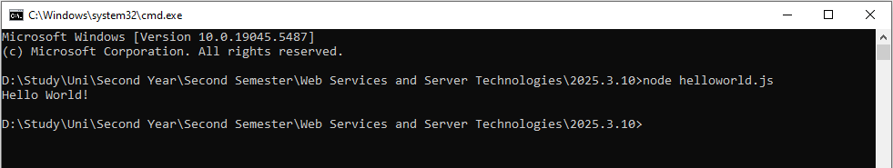
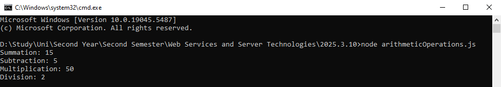
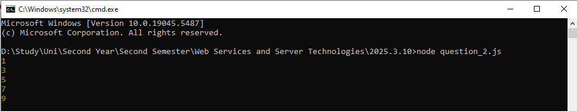
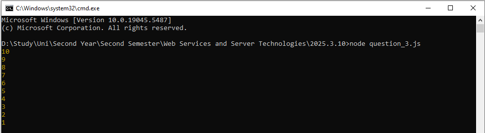
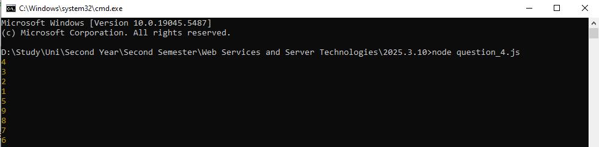
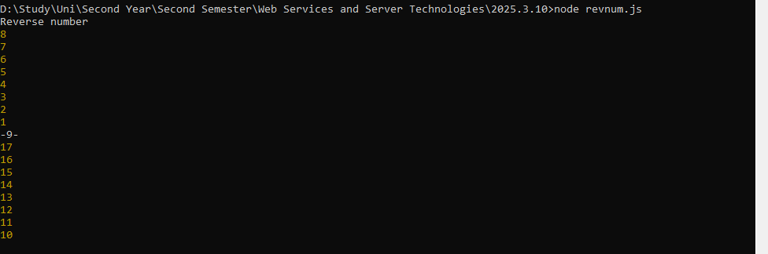

# 📅 2025-03-10 - JavaScript Basics

This folder contains JavaScript practicals from **March 10, 2025**.

## 📜 Lesson Overview  
In this lesson, we covered:
- **Console Output** using `console.log()`
- **Arithmetic Operations** (Addition, Subtraction, Multiplication, Division)
- **Loops** (`for` loops for counting, odd numbers, and reverse order)
- **Number Sequences** including a unique sequence pattern

## 📂 Code Files

| File Name   | Code Explanation | Output Screenshot |
|------------|-----------------|------------------|
| [`helloworld.js`](./Codes/helloworld.js) | Printing "Hello, World!" using `console.log()` |  |
| [`arithmeticOperations.js`](./Codes/arithmeticOperations.js) | Performing basic arithmetic operations (`+`, `-`, `*`, `/`) and printing results |  |
| [`question_1.js`](./Codes/question_1.js) | Printing numbers from 1 to 10 using a `for` loop |  |
| [`question_2.js`](./Codes/question_2.js) | Printing odd numbers from 1 to 10 using an `if` condition inside a loop |  |
| [`question_3.js`](./Codes/question_3.js) | Printing numbers in reverse order (10 to 1) |  |
| [`question_4.js`](./Codes/question_4.js) | Printing numbers in a left-right reversed pattern (Ex: 4321-5-9876) |  |
| [`revnum.js`](./Codes/revnum.js) | Printing numbers in a up-down reversed pattern towards a mid number (Ex: 87654321-9-17 16 15 14 13 12 11 10) |  |

---

