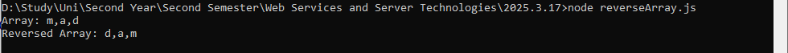

# 📅 2025-03-17 - Arrays

This folder contains JavaScript practicals from **March 17, 2025**.

## 📜 Lesson Overview  
In this lesson, we covered:
- **Arrays:** Numeric, String, and Character arrays
- **Accessing Elements:** Using for loops and forEach loops
- **Nested Loops:** Iterating through multi-dimensional arrays
- **Array Operations:**
    - push(), pop(), and other basic operations
    - Finding common elements in two arrays
    - Finding the most frequent element in an array
    - Reversing an array
    - Printing a simple array
    - Summing array elements
    - Finding a target sum in an array
    - Finding the maximum sum in an array
    - JSON & JSON Arrays: Understanding JSON data and handling JSON arrays
    - JSON Array Exercises: Practical applications with JSON structures

## 📂 Code Files

| File Name   | Code Explanation | Output Screenshot |
|------------|-----------------|------------------|
| [`SimpleArrayPrint.js`](./Codes/SimpleArrayPrint.js) | Printing a simple array with console.log() |  |
| [`stringArray.js`](./Codes/stringArray.js) | String Array |  |	
| [`charArray.js`](./Codes/charArray.js) | Char Array |  |
| [`NumArray.js`](./Codes/NumArray.js) | Num Array |  |
| [`printArrayElements.js`](./Codes/printArrayElements.js) | Accessing array elements using for and forEach loops |  |	
| [`maxNum.js`](./Codes/maxNum.js) | Find the maximum no in an array |  |	
| [`nestedArray.js`](./Codes/nestedArray.js) | Using nested loops to iterate through multi-dimensional arrays |  |	
| [`findCommonElements.js`](./Codes/findCommonElements.js) | Finding common elements between two arrays	 |  |	
| [`targetSum.js`](./Codes/targetSum.js) | Finding pairs of numbers that add up to a target sum | |	
| [`frequentElement.js`](./Codes/frequentElement.js) | Finding the most frequent element in an array |  |
| [`arrayOperations.js`](./Codes/arrayOperations.js) | Performing operations like push() and pop() |  |
| [`reverseArray.js`](./Codes/reverseArray.js) | Reversing an array using push() & pop()|  |
| [`JSON.js`](./Codes/JSON.js) | Parsing and accessing JSON data |  |
| [`JSONArray.js`](./Codes/JSONArray.js) | Array of JSON data |  |
| [`JsonArrayExercise.js`](./Codes/JsonArrayExercise.js) | Working with JSON arrays and performing operations on them	 |  |

---

