# 📅 2025-03-19 - Functions

This folder contains JavaScript practicals from **March 19, 2025**.

## 📜 Lesson Overview  
In this lesson, we covered:
🔹 Function Basics
  - Defining and Calling Functions using function keyword
  - Returning Values from functions
  - Functions with Parameters to accept input
🔹 Advanced Functions
  - Boolean Function to Check Prime Number
  - Recursive Function to print numbers from n to 1
🔹 Arrow Functions & Parameters
  - Arrow Function Syntax (=>)
  - Functions with Default Parameters
  - Using Rest Parameters (...n) for multiple arguments
🔹 Working with Arrays in Functions
  - Summing Array Elements using forEach()
  - Optimized Sum Calculation using .reduce()
🔹 Callbacks & Higher-Order Functions
  - Passing Functions as Arguments
  - Callback Function Execution
  - Using Rest Parameters with Functions

## 📂 Code Files

| File Name   | Code Explanation | Output Screenshot |
|------------|-----------------|------------------|
| [`basicFunctions.js`](./Codes/basicFunctions.js) | Defining and calling basic functions with function keyword| 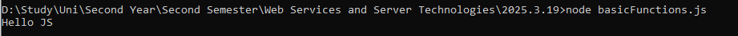 |
| [`returnFunctions.js`](./Codes/returnFunctions.js) | Functions with return values| 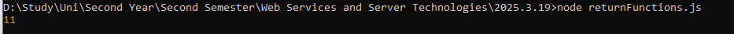 |	
| [`parameterFunctions.js`](./Codes/parameterFunctions.js) | Functions with parameters to accept inputs| 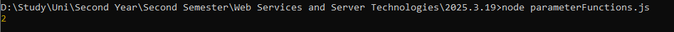 |
| [`primeCheck.js`](./Codes/primeCheck.js) | Boolean function to check if a number is prime | 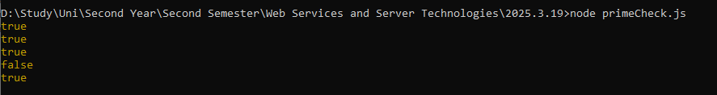 |
| [`recursiveFunction.js`](./Codes/recursiveFunction.js) | Recursive function to print numbers from n to 1| 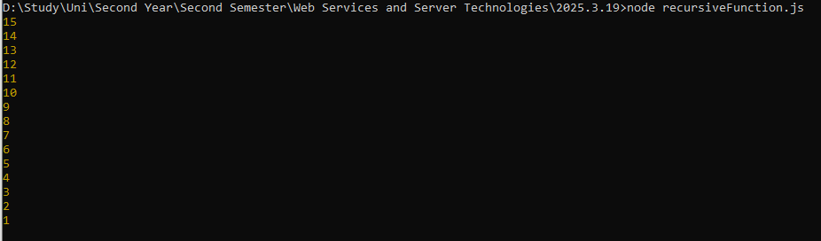 |	
| [`arrowFunction.js`](./Codes/arrowFunction.js) | Writing concise arrow functions using => syntax | 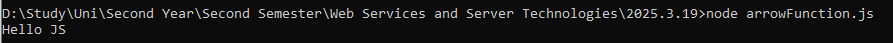 |	
| [`SumArrowFunction.js`](./Codes/SumArrowFunction.js) | Arrow function to sum two numbers | 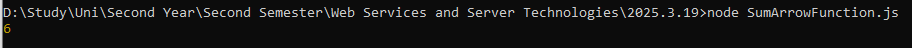 |	
| [`defaultParameter.js`](./Codes/defaultParameter.js) | Functions with default parameters when no argument is given	 | 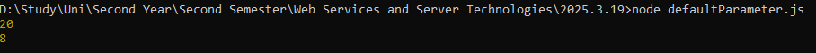 |	
| [`restParameter.js`](./Codes/restParameter.js) | Using rest parameters (...n) to handle multiple arguments | 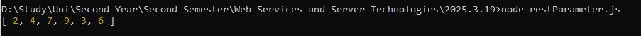|	
| [`SumwithRest.js`](./Codes/SumwithRest.js) | Calculating sum of numbers using forEach() | 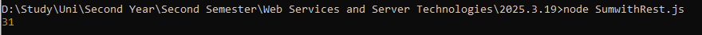 |
| [`SumwithReduce.js`](./Codes/SumwithReduce.js) | Optimizing sum calculation using .reduce() method | 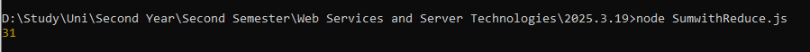 |
| [`callbackFunctions.js`](./Codes/callbackFunctions.js) | Demonstrating callback functions by passing functions as arguments| 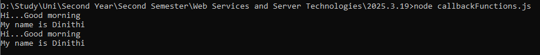 |
| [`higherOrderFunctions.js`](./Codes/higherOrderFunctions.js) | Using higher-order functions (functions that accept other functions as parameters) | 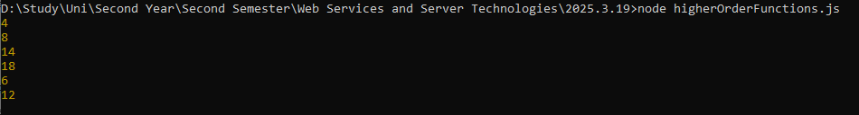 |

---

