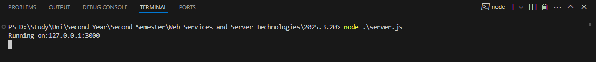
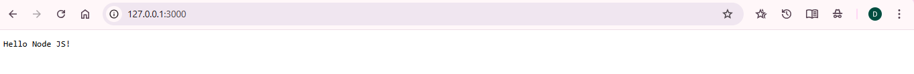
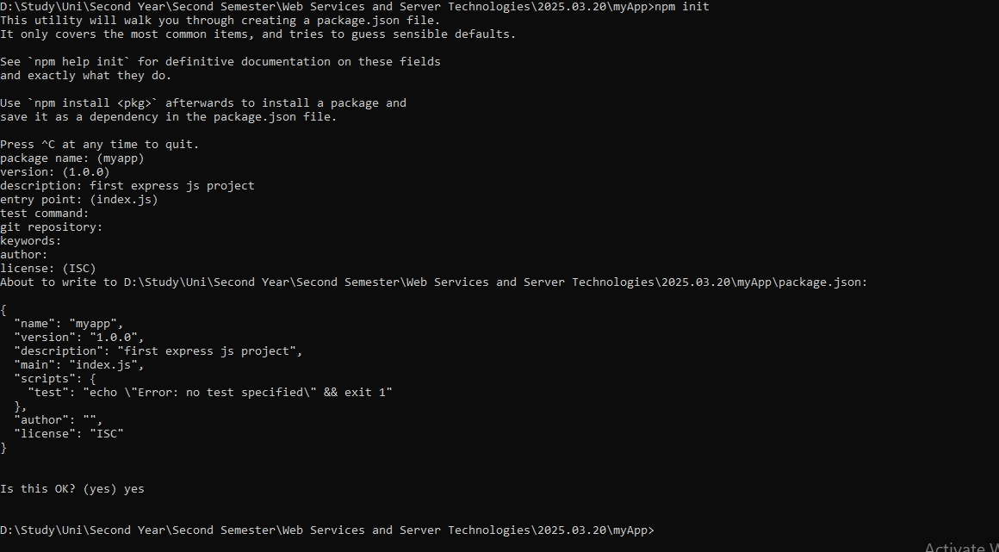
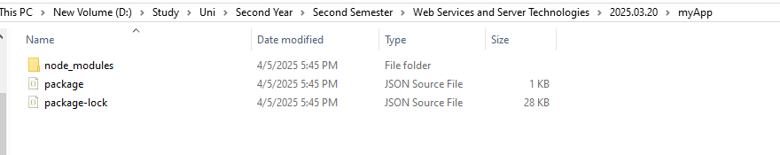
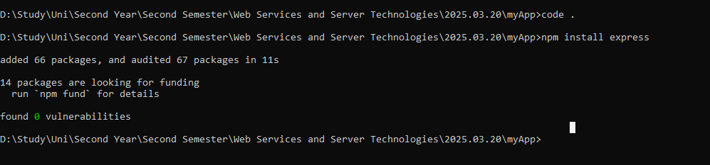
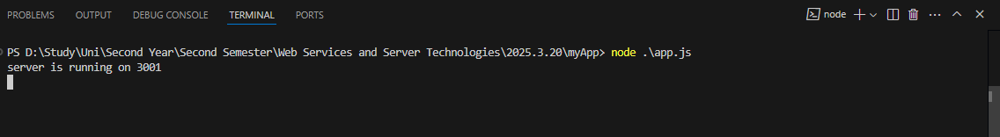
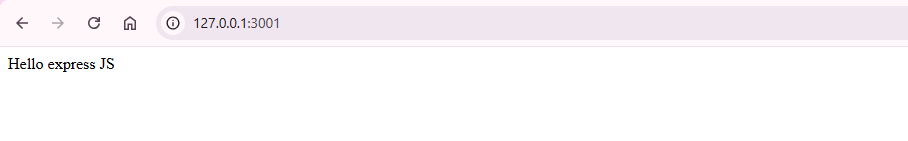
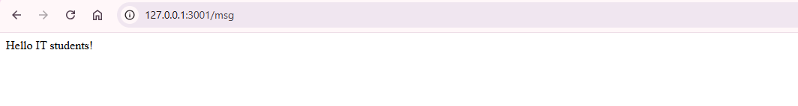

# 📅 2025-03-20 - Intro to Node JS and Express JS

This folder contains JavaScript practicals from **March 20, 2025**.

## 📜 Lesson Overview  
In this lesson, we covered:

🔹 **Node.js Basics**  
  - Introduction to Node.js  
  - Creating a basic web server using Node.js' built-in `http` module

🔹 **Express.js Introduction**  
  - Setting up a basic Express.js project  
  - Creating a simple web server with routes using Express

## 📂 Code Files

| File Name               | Code Explanation                                | Output Screenshot |
|------------------------|--------------------------------------------------|-------------------|
| [`server.js`](./Codes/server.js)       | Basic Node.js server using the `http` module       |    |
| [`app.js`](./Codes/app.js) | Simple Express.js server with route handling       |      |

---
