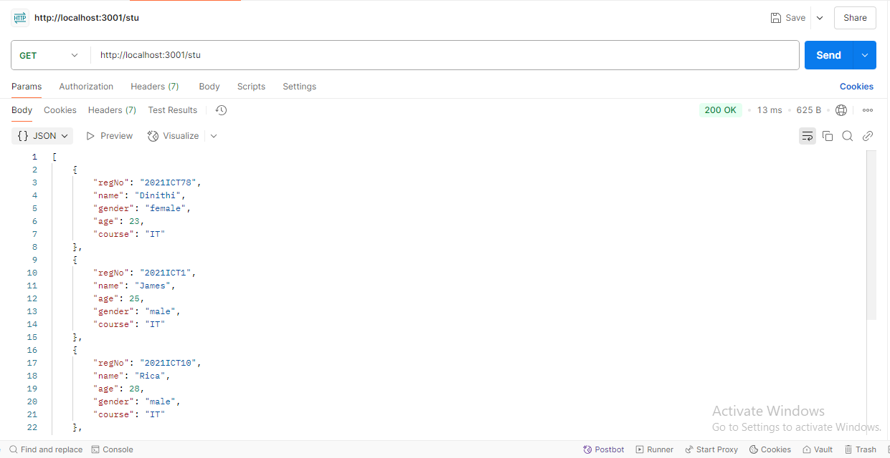
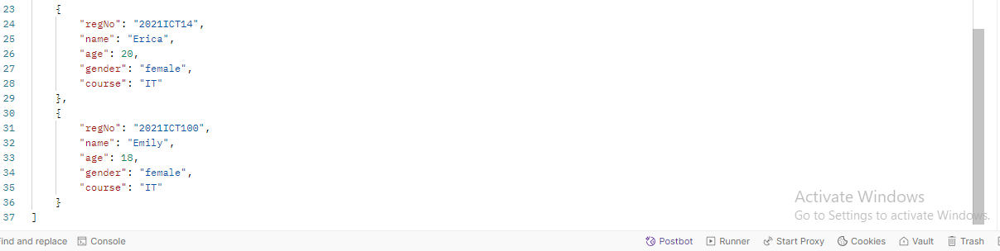
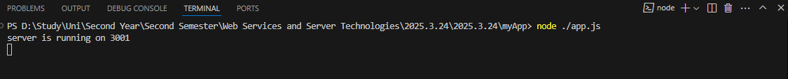
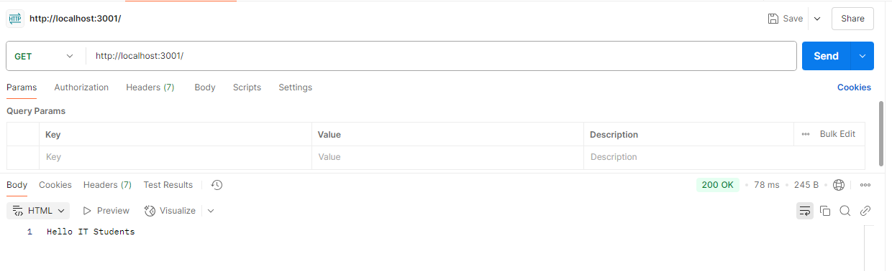
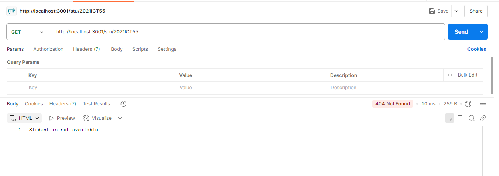
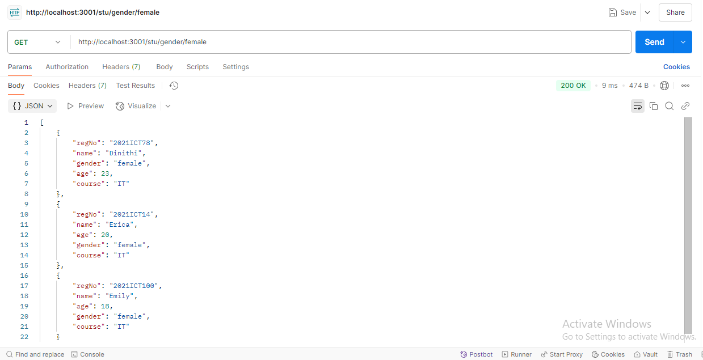
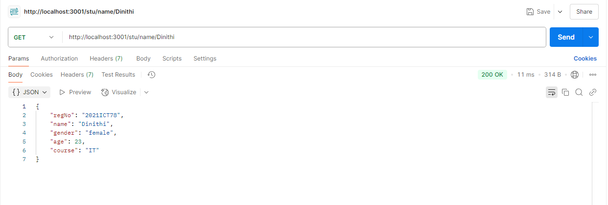

# 📅 2025-03-24 - Working with Student Data using Express.js

This folder contains JavaScript practicals from **March 24, 2025**.

## 📜 Lesson Overview  
In this lesson, we built an Express.js server that works with a student database stored as a JSON array.

🔹 **Data Handling with JSON Arrays**  
  - Stored student records in a JavaScript array
  - Used `module.exports` to export student data from a separate file

🔹 **Express.js API Endpoints**  
  - `GET /` → Home route for server status  
  - `GET /stu` → Returns all students  
  - `GET /stu/:id` → Returns student by Registration Number  
  - `GET /stu/gender/:gen` → Filters students by gender  
  - `GET /stu/name/:name` → Searches for a student by name  

🔹 **Additional Concepts Covered**  
  - `find()` vs `filter()` usage  
  - Basic error handling (404 response when student not found)  
  - Dynamic route parameters in Express.js

🔌 API Endpoints
🌍 GET /
Description: Welcome endpoint
Response: Hello IT Students
📚 GET /stu
Description: Returns a list of all students.
Response: A JSON array of student objects.
🆔 GET /stu/:id
Description: Find a student by registration number.
Example: /stu/2021ICT47
Response: The student data matching the registration number, or a "Student not found" message.
🚻 GET /stu/gender/:gen
Description: Filter students by gender.
Example: /stu/gender/female
Response: A list of students matching the gender.
👤 GET /stu/name/:name
Description: Search for a student by name.
Example: /stu/name/Emily
Response: The student data matching the name.

## 📂 Code Files

| File Name                | Code Explanation                                      | Output Screenshot         |
|-------------------------|-------------------------------------------------------|---------------------------|
| [`studentsdb.js`](./Codes/studentsdb.js) | Contains an array of student JSON objects|          |
| [`app.js`](./Codes/app.js) | Express.js server to serve student data through APIs|         |

---
