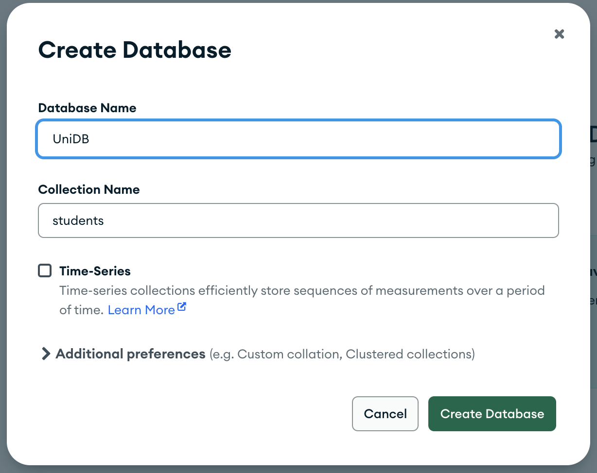
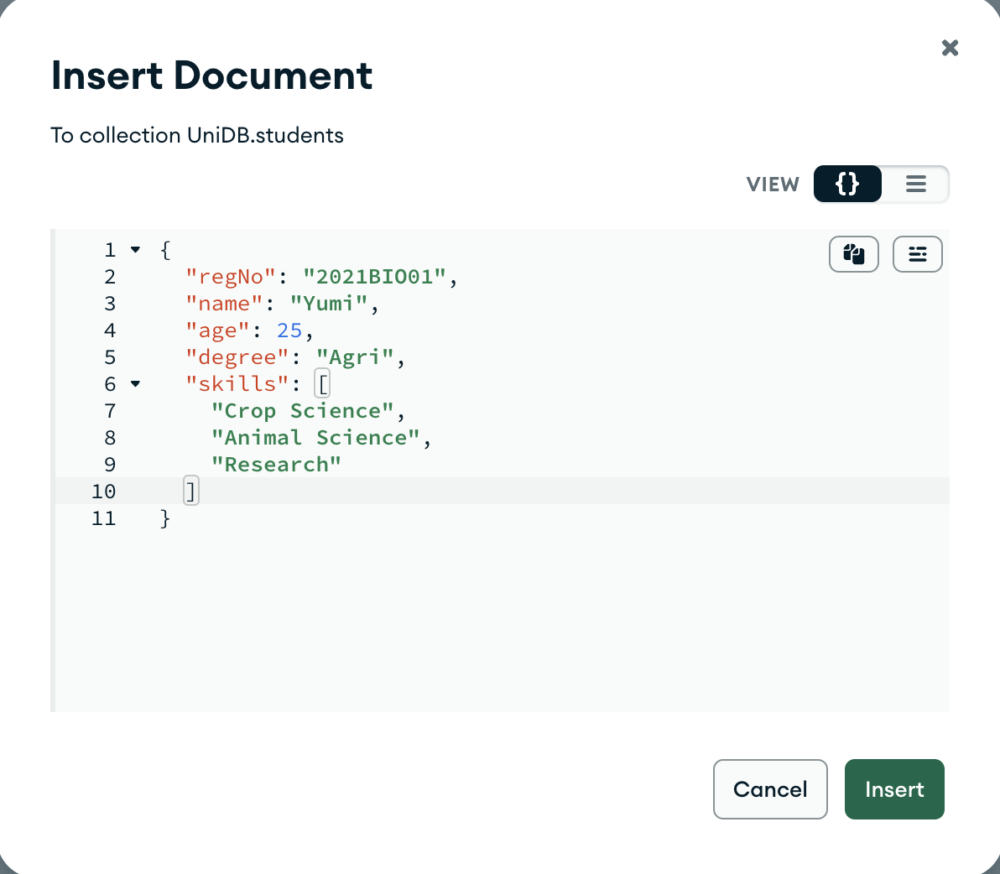
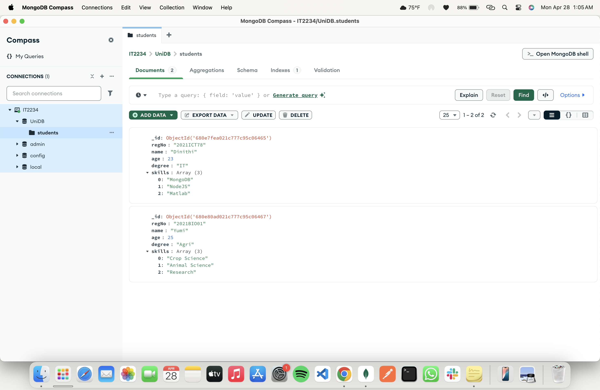
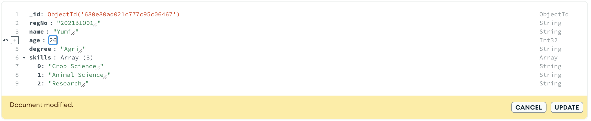
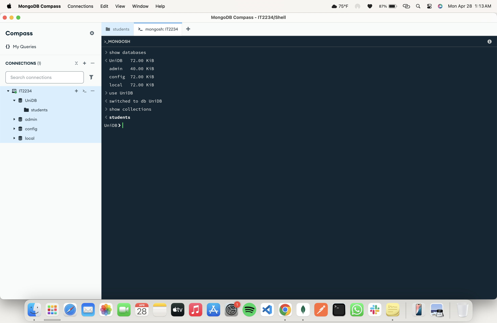
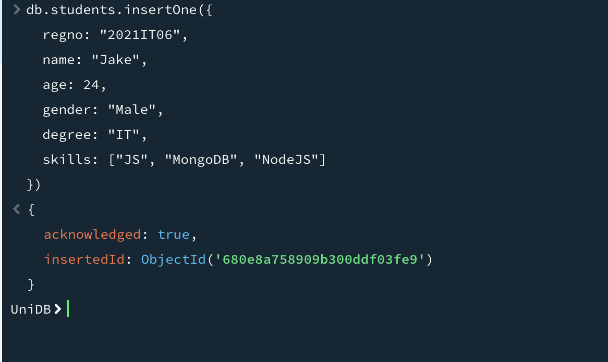
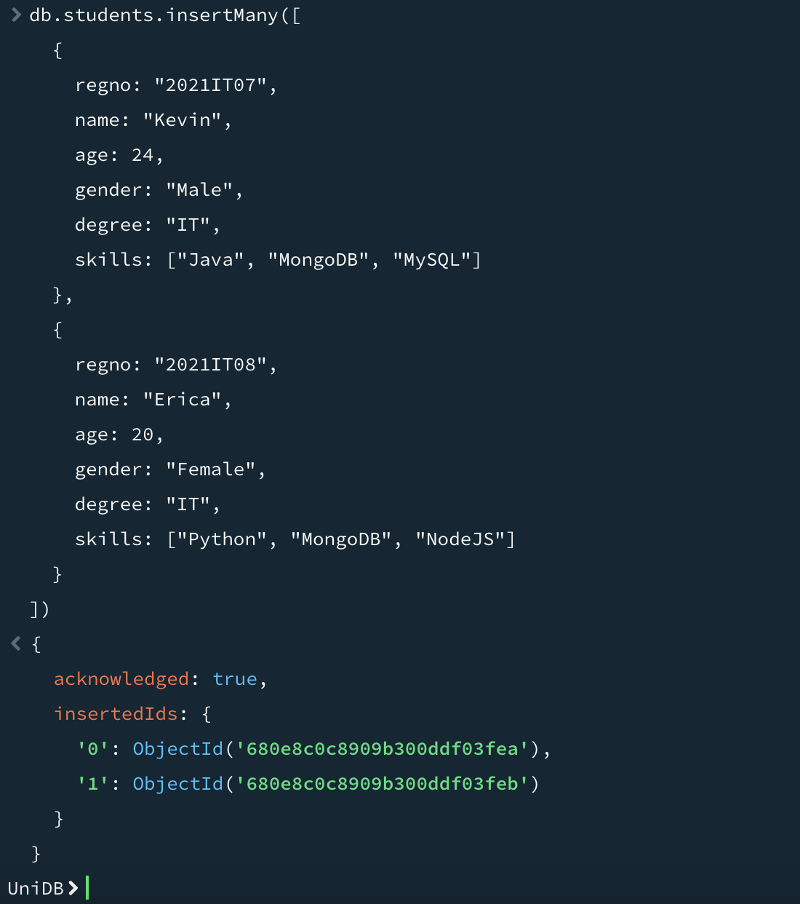

# 📅 2025-04-24 - 🍃 MongoDB 

This folder contains MongoDB practicals from **April 24, 2025**.

## 📜 Lesson Overview  
In this lesson, we learned the following,
- **Database Creation**
- **Collections**
- **CRUD Operations**
- **Queries**

---

## 🧩 MongoDB Basic Terms

| Term         | Meaning |
|--------------|---------|
| **Database** | Holds collections (like a folder) |
| **Collection** | Group of documents (similar to a table) |
| **Document** | Single record (stored in BSON format) |
| **_id**      | Unique identifier auto-generated for every document |

---

## 🏗️ 1. Creating Database and Collections (Compass)

- Open **MongoDB Compass**.
- Click **Create Database**.
- Enter:
  - **Database Name**: `uniDB`
  - **Collection Name**: `students`
- Click **Create Database**.

> 


## ✍️ 2. Inserting Documents (Compass)

- Inside the collection, click **Insert Document**.
- Add keys and values.
- Save.

> 
> 

---
---

## 📝 3. Editing Documents (Compass)

- Find the document.
- Click **Edit**.
- Update values and click **Update**.

> 

---

## 🖥️ 4. Insert Documents (MongoDB Shell)
First show available databases and select **UniDB** and show the collections it has.(students)


### ➔ Insert One Document
```javascript
db.students.insertOne({
  regno: "2021IT06",
  name: "Jake",
  age: 24,
  gender: "Male",
  degree: "IT",
  skills: ["JS", "MongoDB", "NodeJS"]
})
```


### ➔ Insert many documents
```javascript
db.students.insertMany([
  {
    regno: "2021IT07",
    name: "Kevin",
    age: 24,
    gender: "Male",
    degree: "IT",
    skills: ["Java", "MongoDB", "MySQL"]
  },
  {
    regno: "2021IT08",
    name: "Erica",
    age: 20,
    gender: "Female",
    degree: "IT",
    skills: ["Python", "MongoDB", "NodeJS"]
  }
])
```

