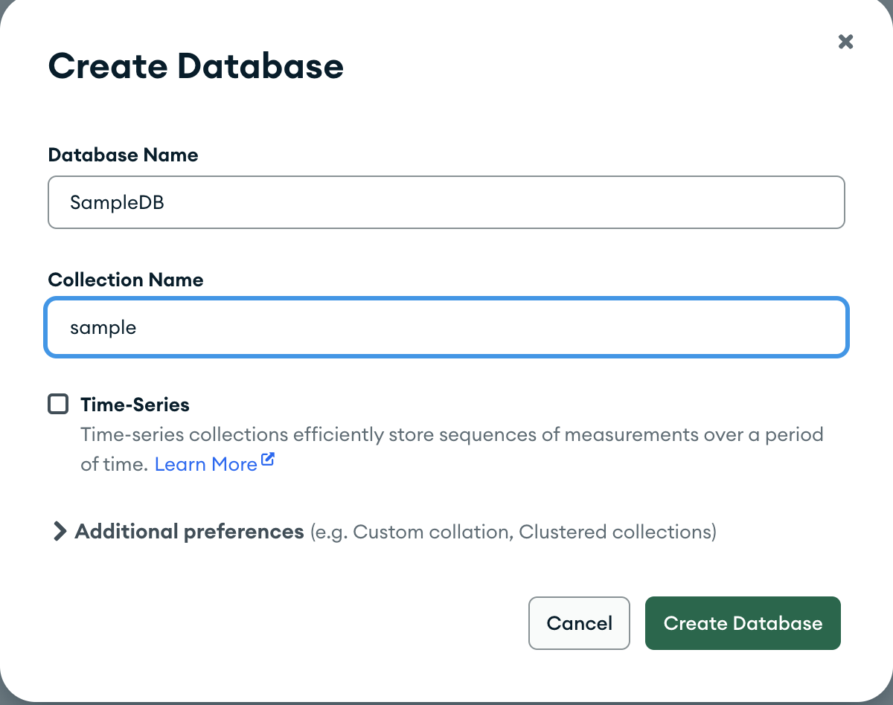
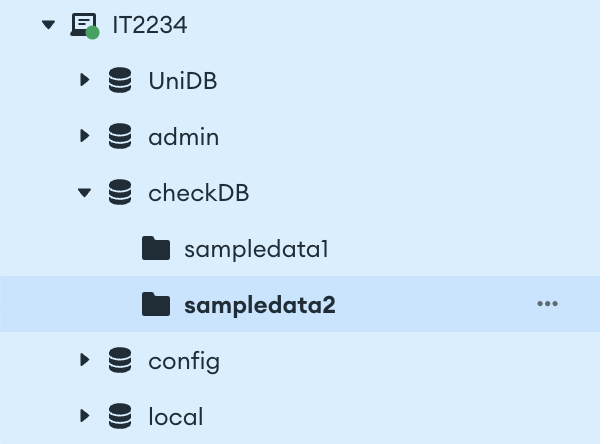
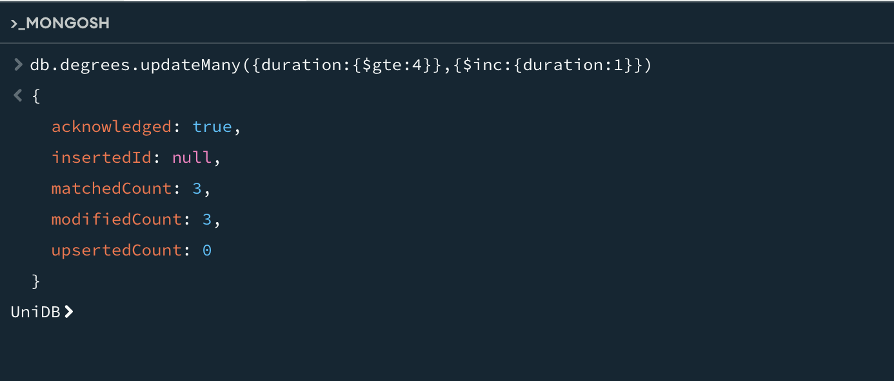

# 📅 2025-04-28 - 🍃 Delete & Update Queries in MongoDB Shell

This folder contains MongoDB practicals from **April 28, 2025**.

## 📜 Lesson Overview  
In this lesson, we learned the following,
- **Update query**
- **Delete Query**
---

## 1. Delete 

### Delete a database
First Creata a database called **"SampleDB"** and a collection called **"sample"**
> 
> 
> 

### Delete a collection
Create another database now called "checkDB" and collections sampledata1, sampledata2


And use **db.sampledata1.drop()** to delete a specific collection


Now, create a collection called **"degrees"** and add some documents

```javascript
db.degrees.deleteOne({_id:ObjectId('681099adbebe01a645f7f029')})
```


### Projections

```javascript
db.degrees.find().projection(['name'])
```


project only the names in a proper way
```javascript
db.degrees.find({},{name:1,_id:0}).pretty()
```


delete the degree programs which are less than 3 years in duration
```javascript
db.degrees.deleteMany({duration:{$lt:4}})
```


## 2. Update 

### Update a document
Add a new document which we later need to update.


```javascript
db.degrees.updateOne({_id:ObjectId('68109de0bebe01a645f7f031')},{$set:{name:'BIT',duration:3}})
```


Check whether the updated one is available or not.

```javascript
db.degrees.findOne({_id:ObjectId('68109de0bebe01a645f7f031')})
```


Increase the duration of degrees with a duration of equal or greater than 4 years.

```javascript
db.degrees.updateMany({duration:{$gte:4}},{$inc:{duration:1}})
```


Add a new element(skill) into this particular student in student collection
```javascript
db.students.updateOne({regNo:"2021BIO01"},{$push:{skills:'Coding'}})
```


Check whether it's updated correctly.
```javascript
db.students.findOne({regNo:'2021BIO01'})
```

