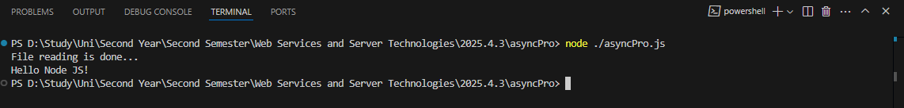
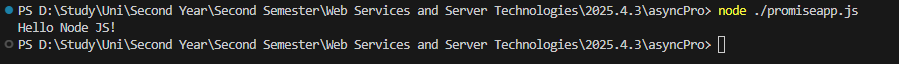
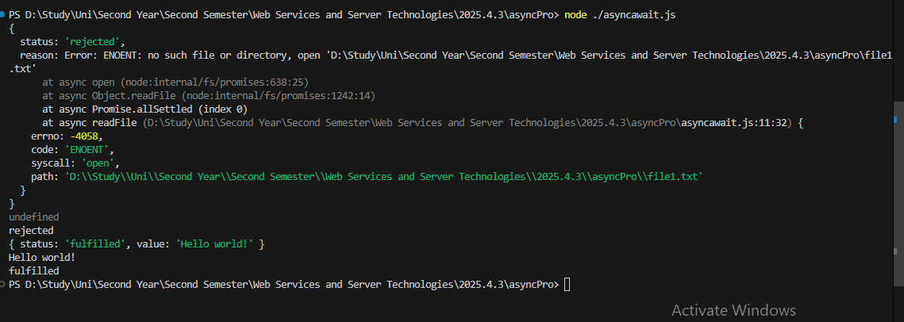

# 📅 2025-04-03 - File Handling & Promises in Node.js
This folder contains JavaScript practicals from **April 03, 2025**.

## 📜 Lesson Overview  
In this lesson, we learn about what are promises and how to use them.

## ✅ What We Learned:

### 🔹 Basic File Reading with Callback
- Used `fs.readFile()` to read the contents of `file.txt`.
- Handled errors using the **callback pattern**.
- Demonstrated asynchronous behavior in Node.js.

---

### 🔹 Understanding Promises
- Introduced **Promises** as a modern way to handle asynchronous operations.
- Explained promise states:
  - **Pending**: Initial state
  - **Resolved**: Operation completed
  - **Rejected**: Operation failed

---

### 🔹 Reading Files using Promises
- Used `fs.promises.readFile()` to return a promise.
- Handled results using `.then()` and `.catch()` syntax.

---

### 🔹 Async / Await with File Reading
- Utilized `async` function and `await` for clean and readable async code.
- Used `Promise.allSettled()` to read multiple files (`file.txt` and `data.txt`) simultaneously.
- Displayed each promise's:
  - **value**
  - **status**

---

## 📂 Folder Table (Inside This Lesson Folder)

| 📄 File Name         | 📘 Code Description                                                | 🖼️ Output Screenshot |
|----------------------|--------------------------------------------------------------------|-----------------------|
| [`asyncPro.js`](./Codes/asyncPro.js) | Reading file using `fs.readFile()` with callback |  |
| [`promiseapp.js`](./Codes/promiseapp.js)  | Reading file using Promises (`.then()` / `.catch()`) |   |
| [`asyncawait.js`](./Codes/asyncawait.js)   | Reading multiple files using `async/await` and `Promise.allSettled()`|  |

---
