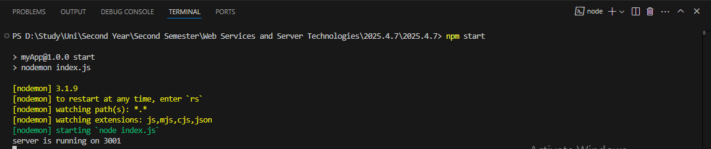
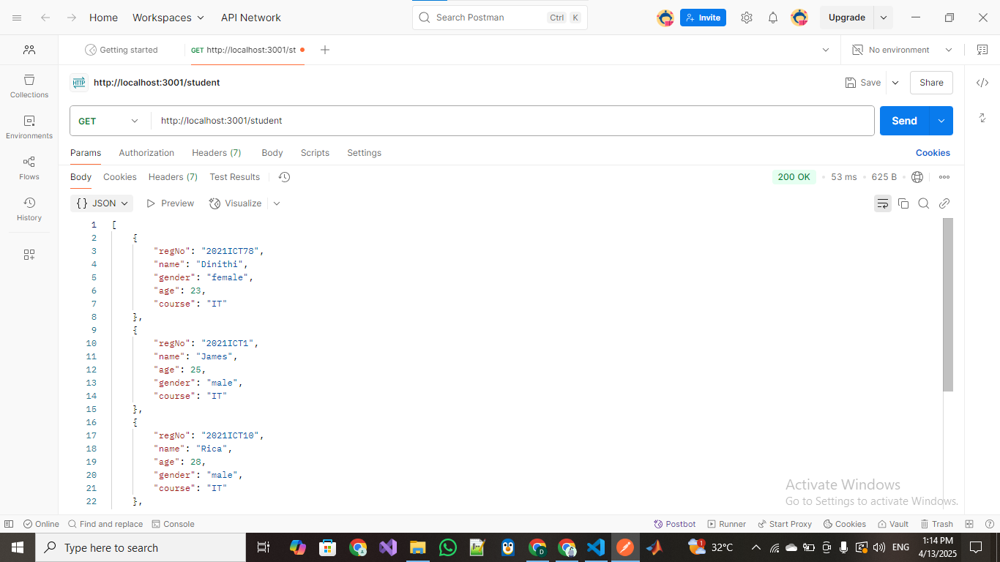
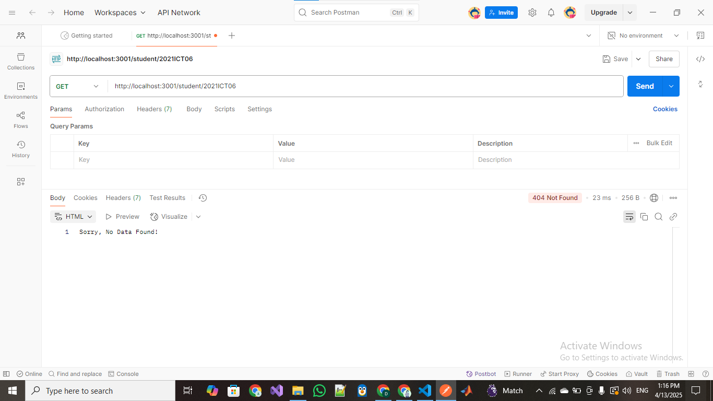
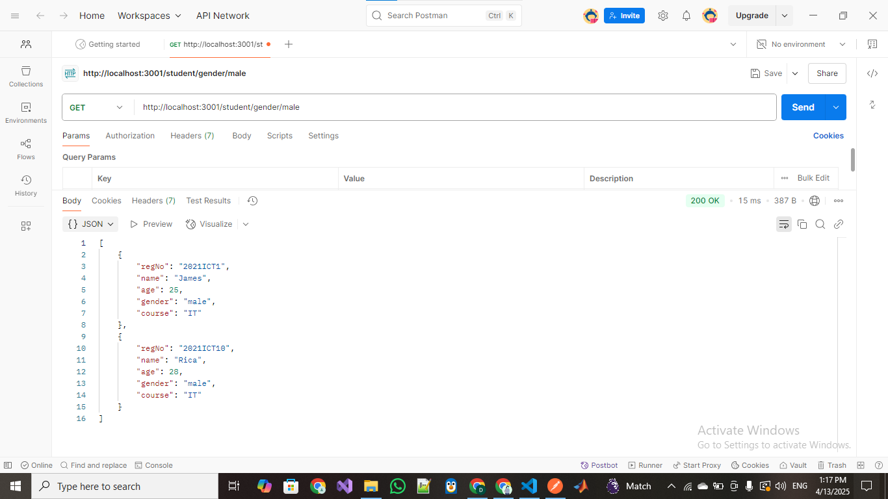

# 📘 Building a RESTful Student API with Express.js

## ✅ What We Learned:

### 🔹 Creating a Student Database
- Defined an array of student objects in `studentsdb.js`.
- Each student object contains:
  - **regNo**
  - **name**
  - **gender**
  - **age**
  - **course**

---

### 🔹 Service Layer for Business Logic
- Built functions in `studentservice.js` to:
  - Get all students.
  - Find a student by `regNo`.
  - Filter students by gender.

---

### 🔹 Express Router for API Endpoints
- Created routes in `studentroute.js`:
  - `GET /student/` – fetch all students.
  - `GET /student/:id` – fetch a student by registration number.
  - `GET /student/gender/:gen` – fetch students by gender.

---

### 🔹 Connecting Everything in `index.js`
- Set up an Express server on port `3001`.
- Used `express.json()` and the student routes under `/student`.

---

## 📂 Folder Table (Inside This Lesson Folder)

| 📄 File Name              | 📘 Code Description                                        |
|---------------------------|------------------------------------------------------------|
| [`studentsdb.js`](./Codes/studentsdb.js)        | Contains student data as a JS array                     |
| [`studentservice.js`](./Codes/studentservice.js)| Exports functions for data handling (get, find, filter) |
| [`studentroute.js`](./Codes/studentroute.js)    | Sets up routes and handles API responses                |
| [`index.js`](./Codes/index.js)                  | Starts the server and mounts the student route          |

---

### 🖼️ Output Screenshots

| Screenshot |
|------------|
|  |
|  |
|  |
|  |
|  |
|  |
|  |

