# 📅 2025-05-15 - ICAE 02

Here's the ICAE paper.
📄 [View ICAE02 Paper](./Paper/IT2234_ICAE02.pdf)

## 📂 Code Answer Files

| File Name               | Output Screenshot         |
|-------------------------|---------------------------|
| Create the students and grades collections and insert the sample documents into both collections. | 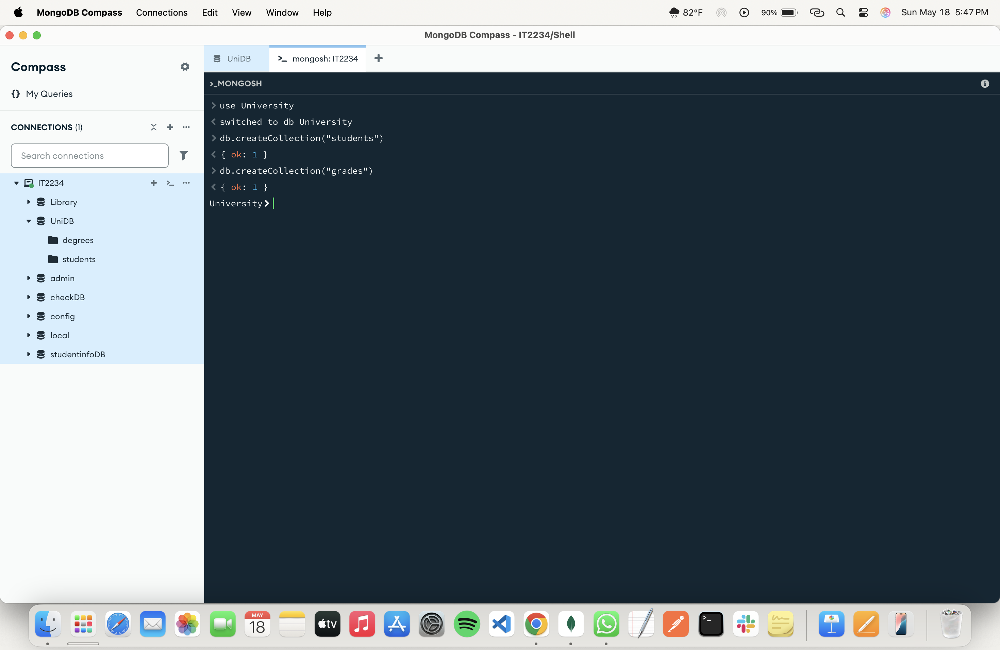 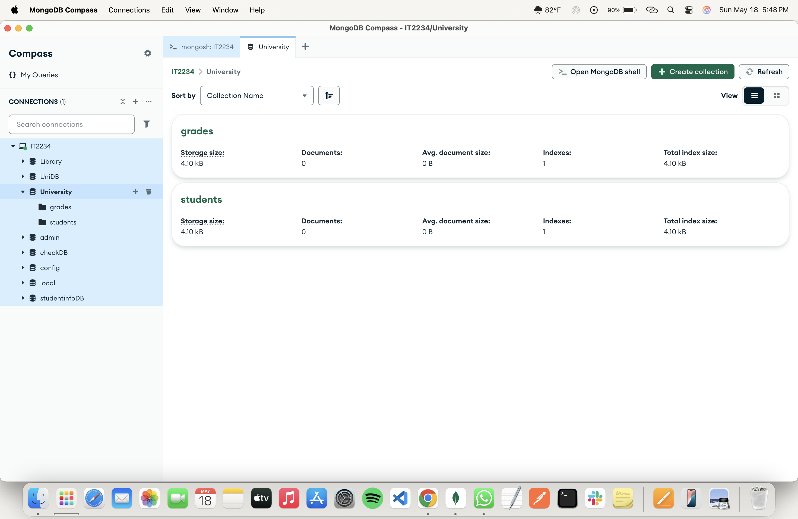 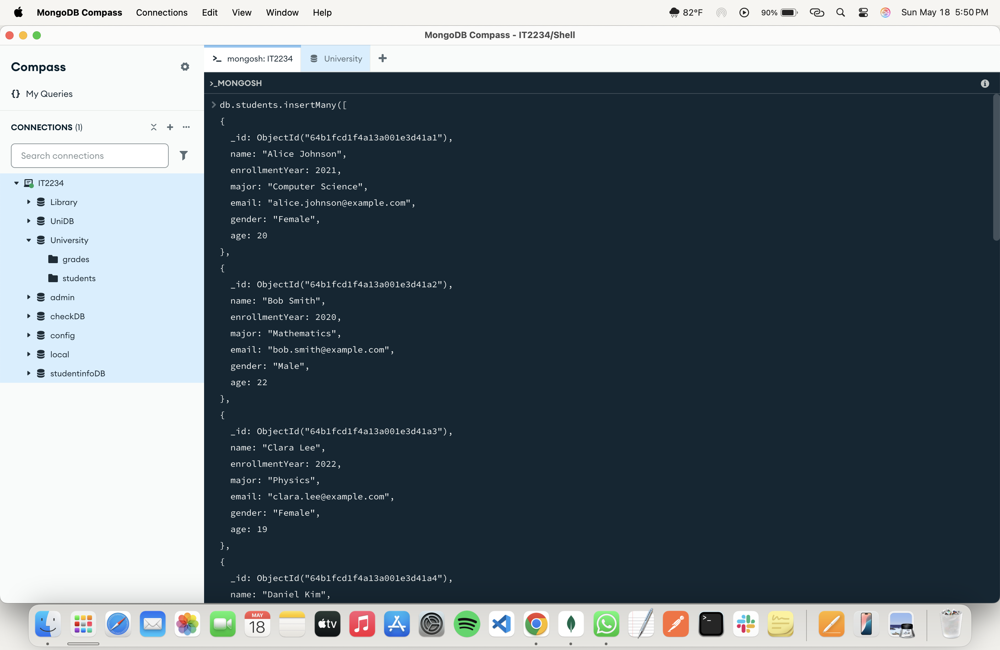 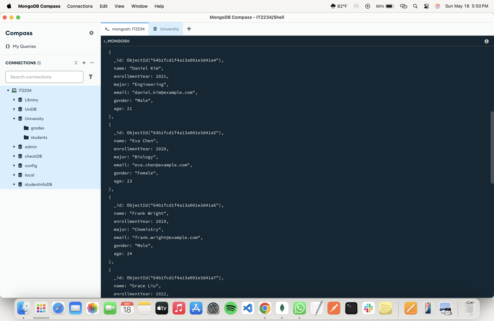  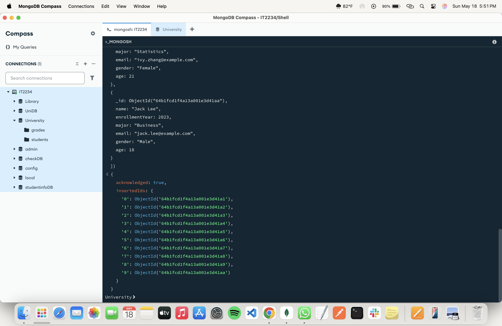 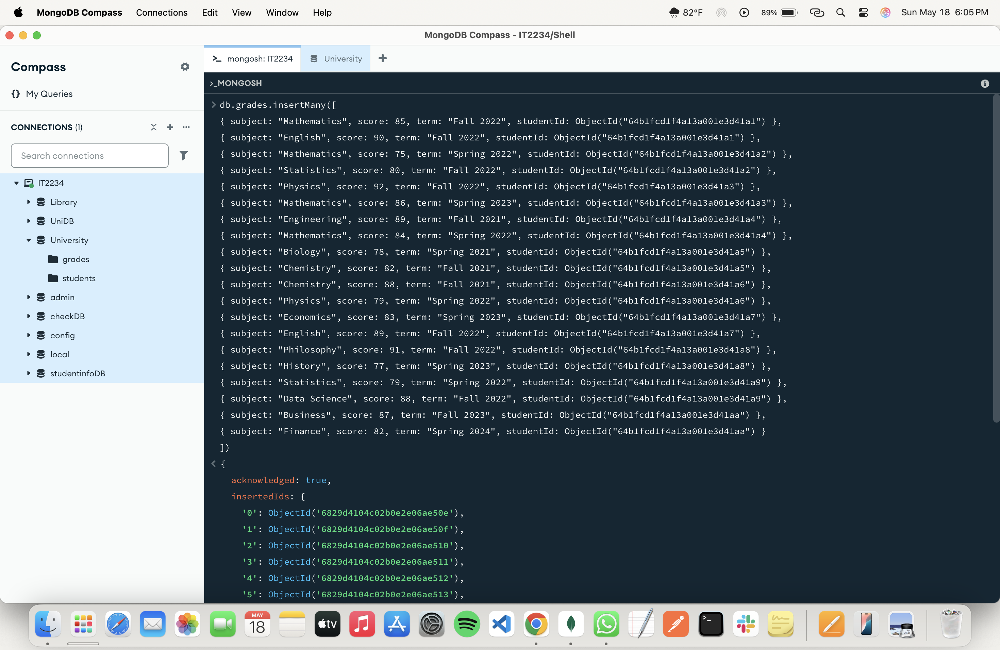 |
| Show both collections in table view.  | 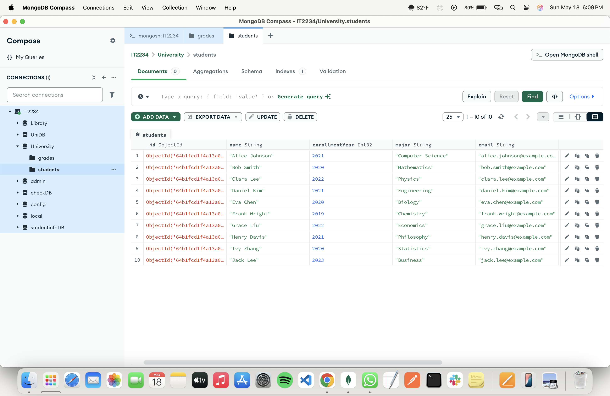 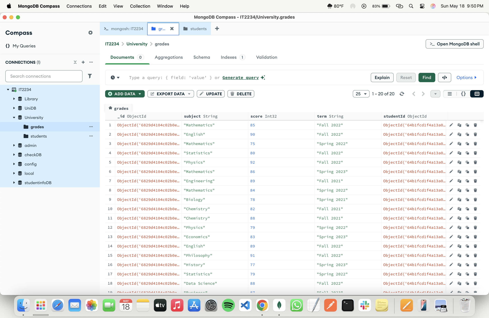|
| Find the female students and only display their name, age and gender. | 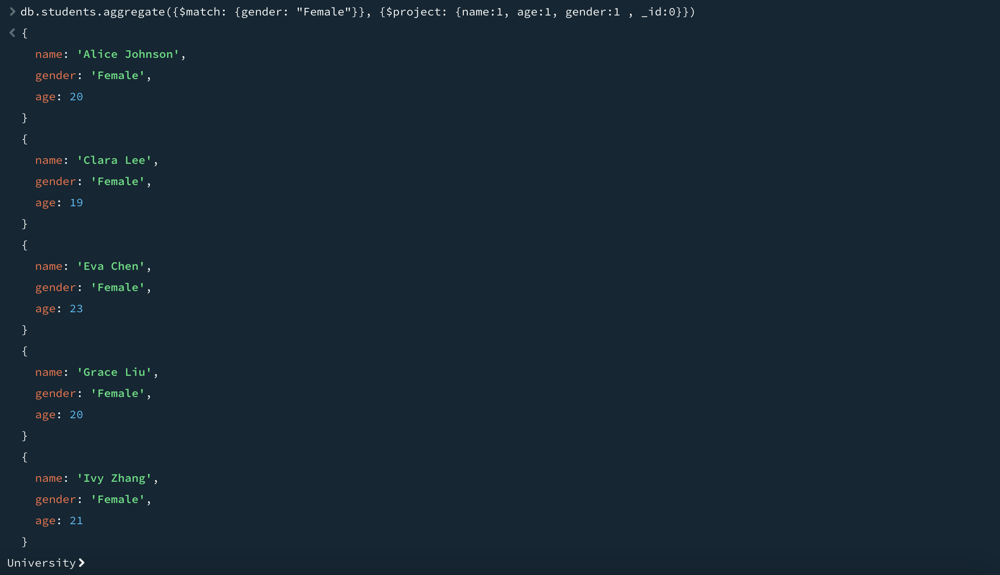|
| Find the students who are younger than 22 and enrolled after 2020. | 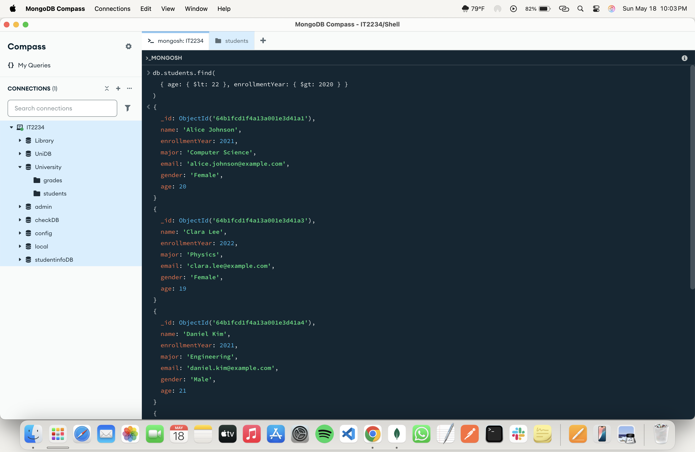 |
| Find all grades for "Alice Johnson". | 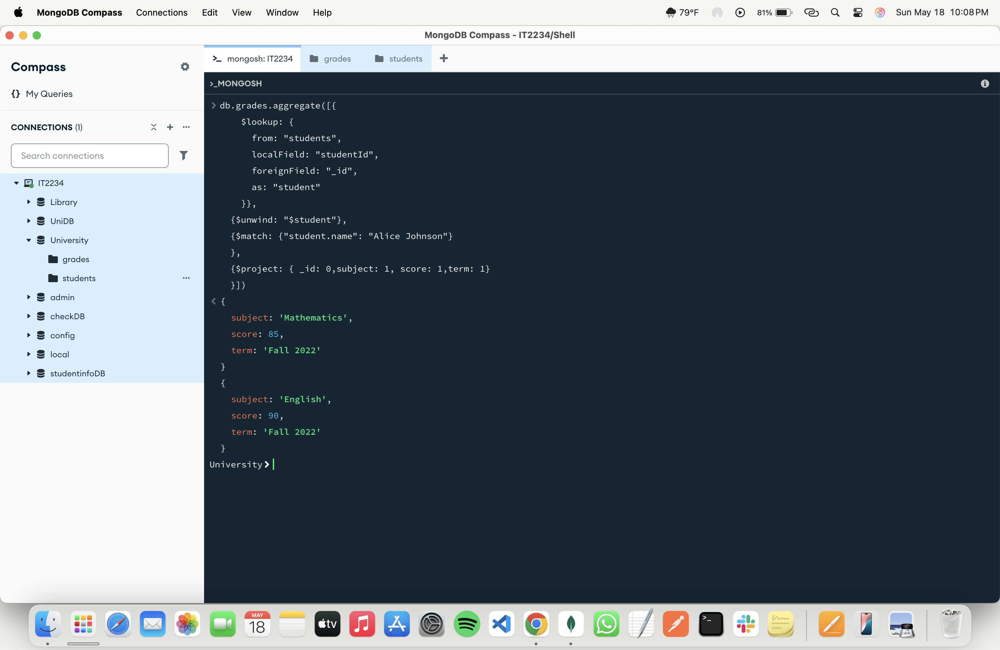|
| Find how many students followed the subject “Mathematics”. | |
| Find all students with grades in the term "Fall 2022". | 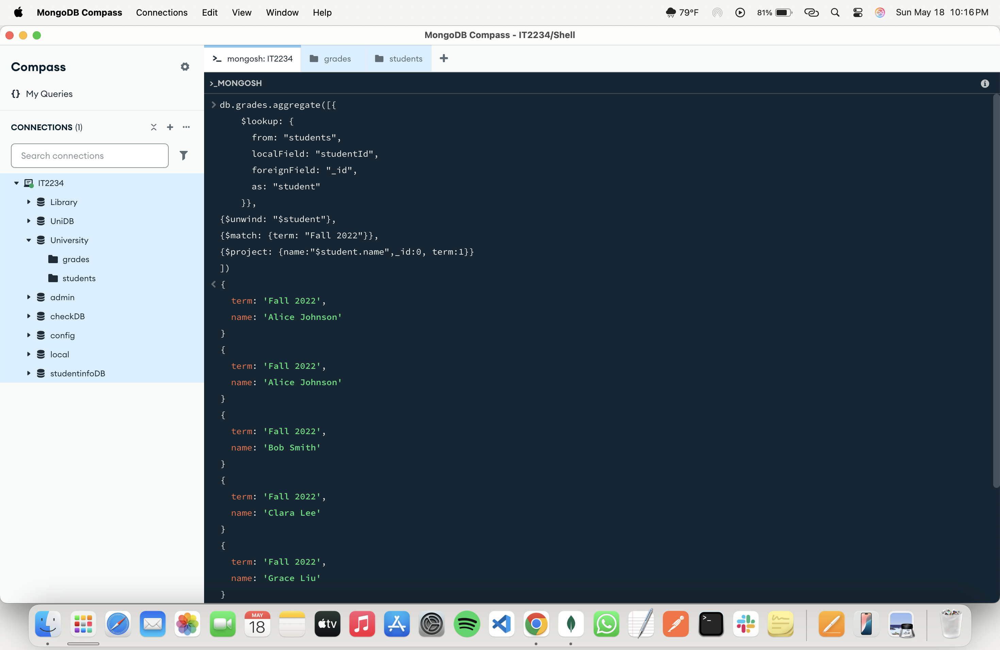 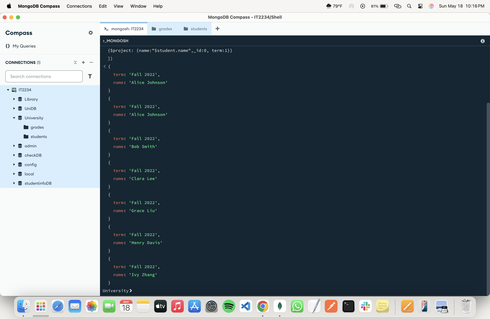|

---
