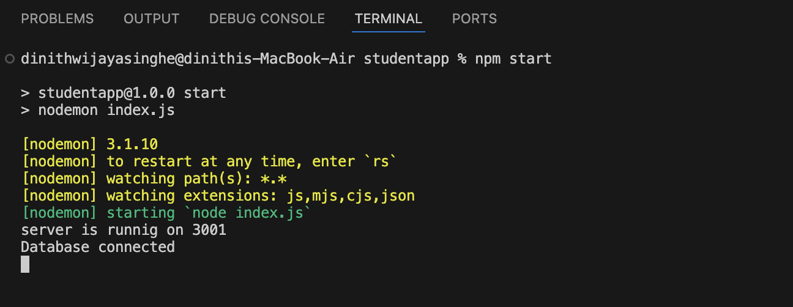
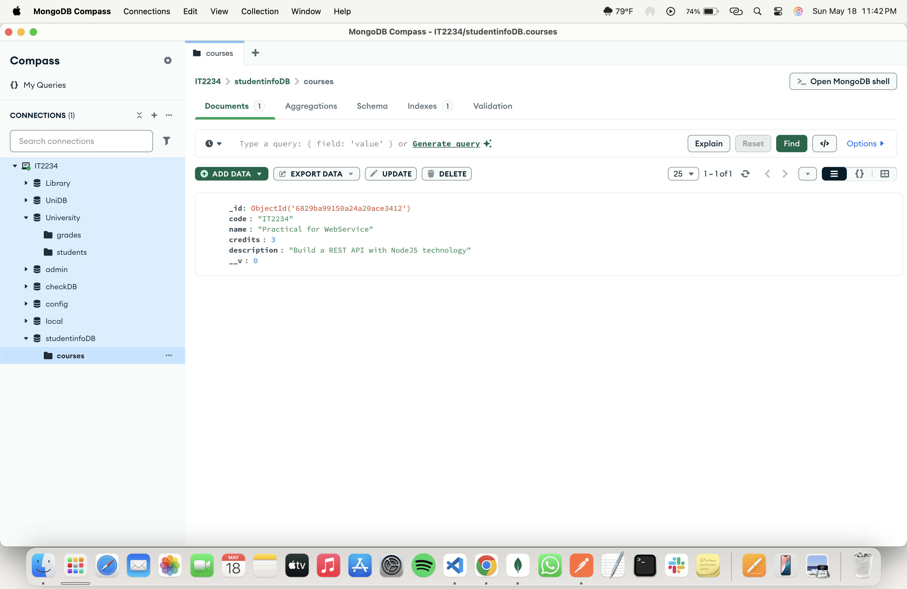
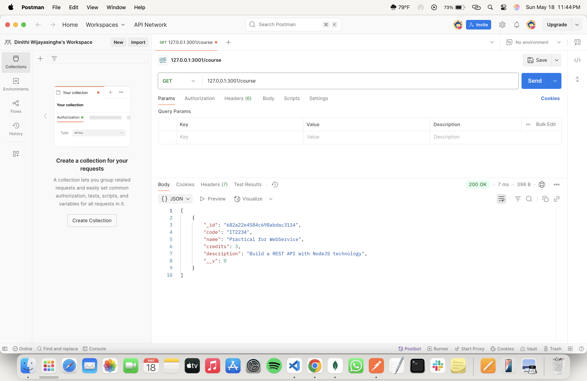
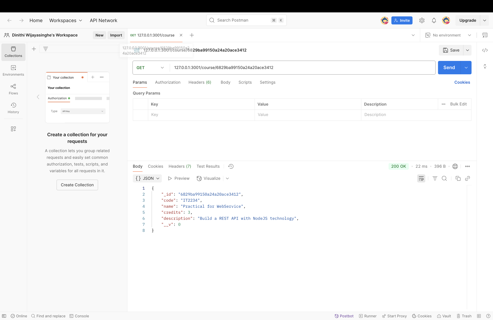
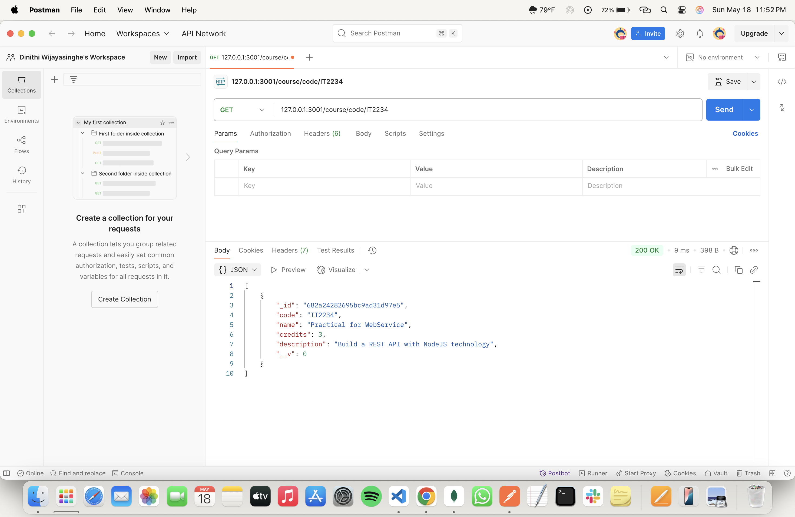

# 📅 2025-05-17 - 🍃 Using Mongoose - OOP Library

This folder contains MongoDB practicals from **May 17, 2025**.

## 📜 Lesson Overview  
In this lesson, we learned the following,
- **How to use mongoose OOP library with javascript and node.js**
---

Create a database and add the document to a collection using OOP concepts in mongoose.

Search for courses in the database (only have one document)

Search for a course using the Object ID

Search for a course by using the course Id

