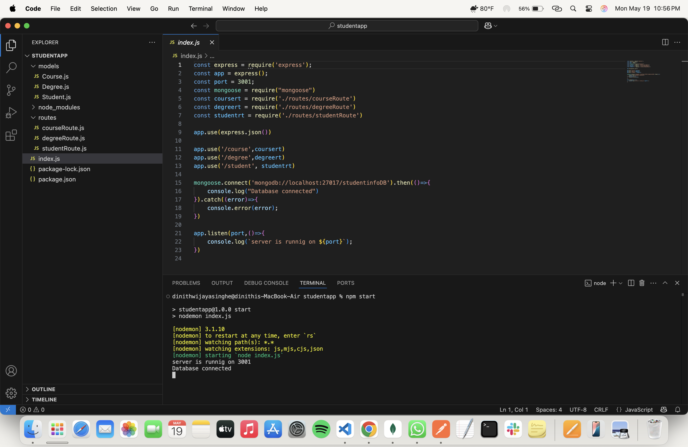
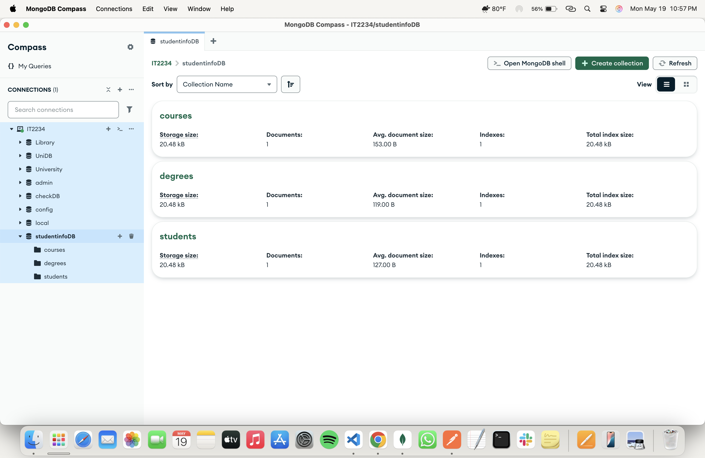
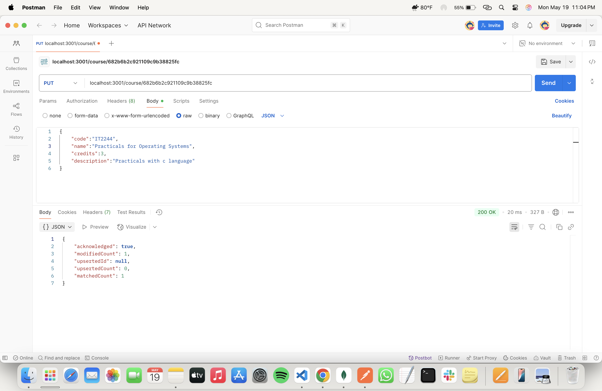
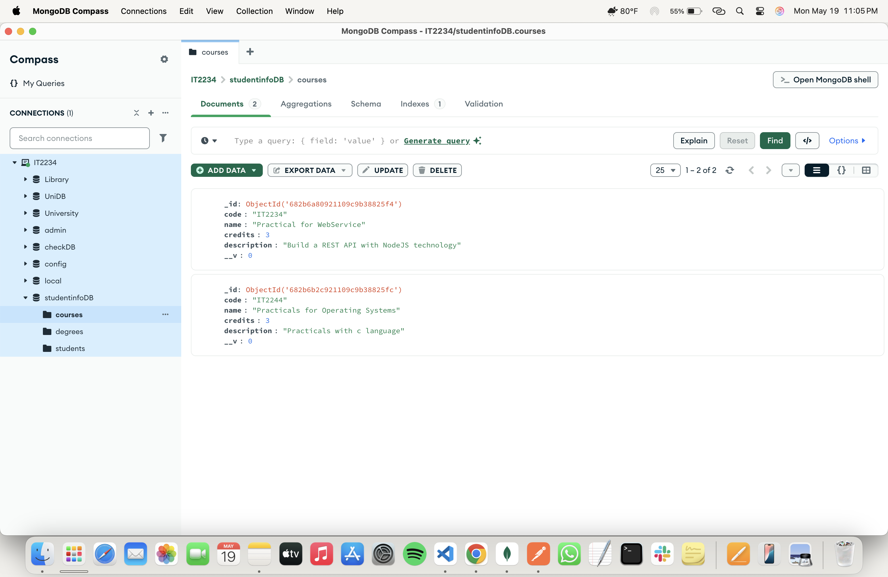
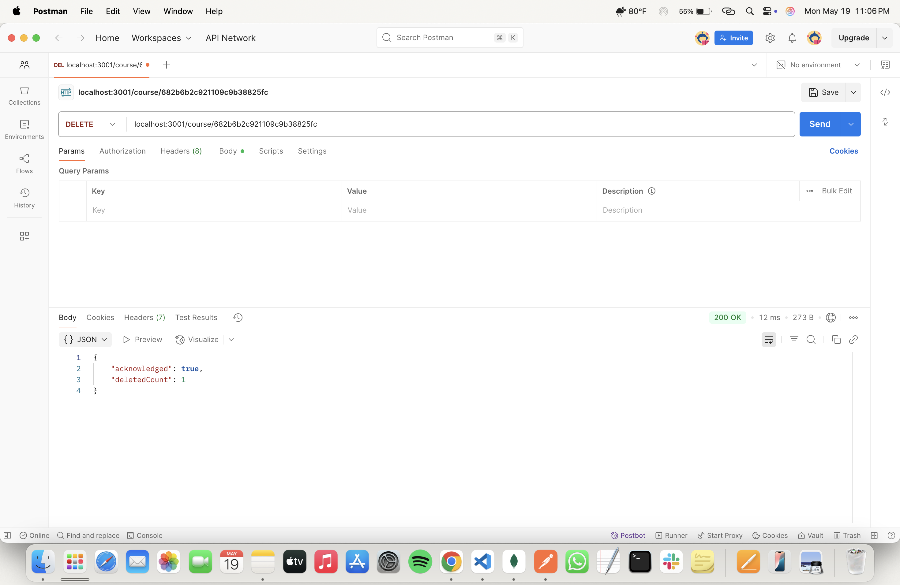
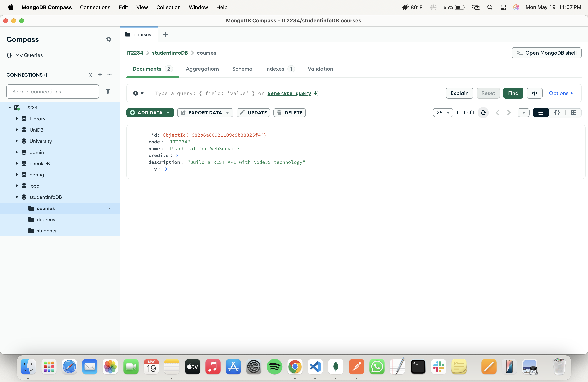
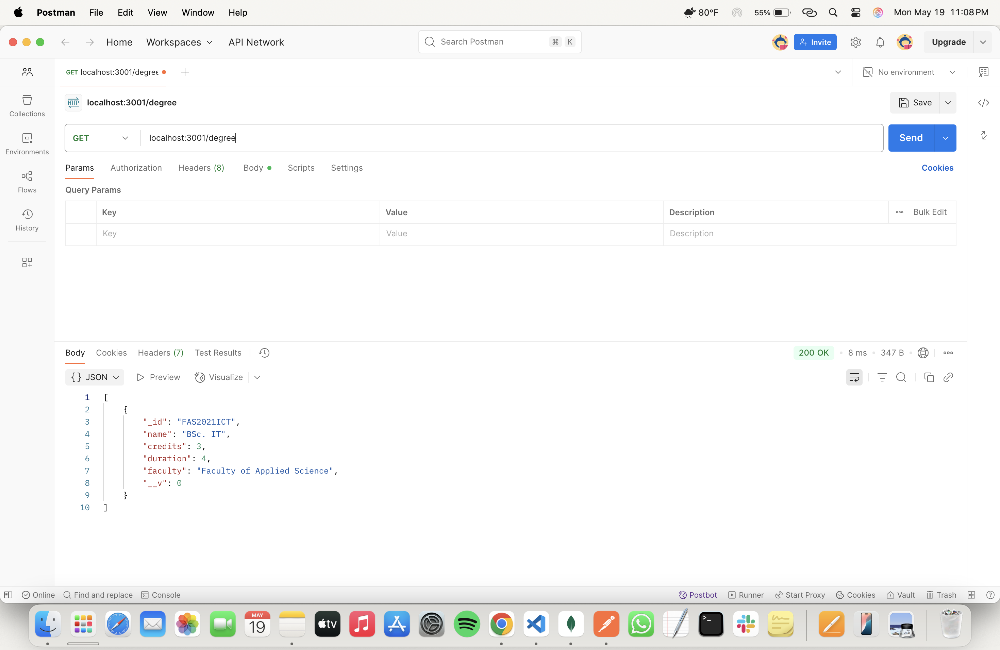
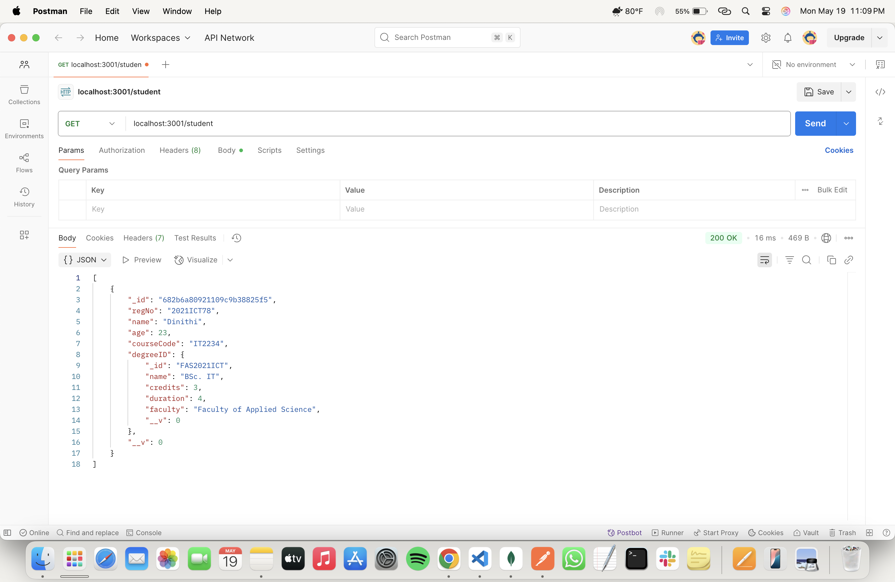

# 📅 2025-05-19 - 🍃 Using Mongoose & GET, POST, PUT, DELETE requests & Connecting collections via a foreign key

This folder contains MongoDB practicals from **May 19, 2025**.

## 📜 Lesson Overview  
In this lesson, we learned the following,
- **How to use mongoose OOP library with javascript and node.js**
- **How to use POST, GET, PUT, DELETE request**
- **How to connect collections via foreign key**
---

### Add a document for each students and degrees collections

### Put data into a collection via POST request

### Update data in a collection via PUT request

### Delete data in a collection via DELETE request

### Search for degrees in the degrees collection via GET request

### Search for students in the students collection via GET request & Use the foreign key concept to display the degree program details

