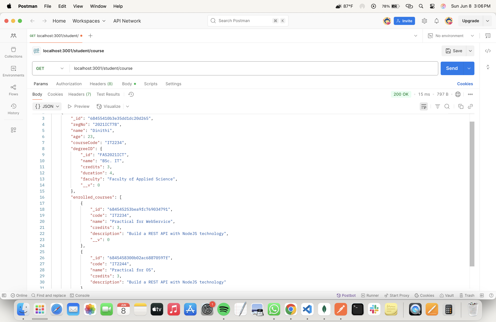

# 📅 2025-05-22 - 🍃 Using Mongoose & sub routes
This folder contains MongoDB practicals from **May 22, 2025**.

## 📜 Lesson Overview  
In this lesson, we learned the following,
- **How to create sub routes for different get querie requests**
---

### Get the student details including the course details

