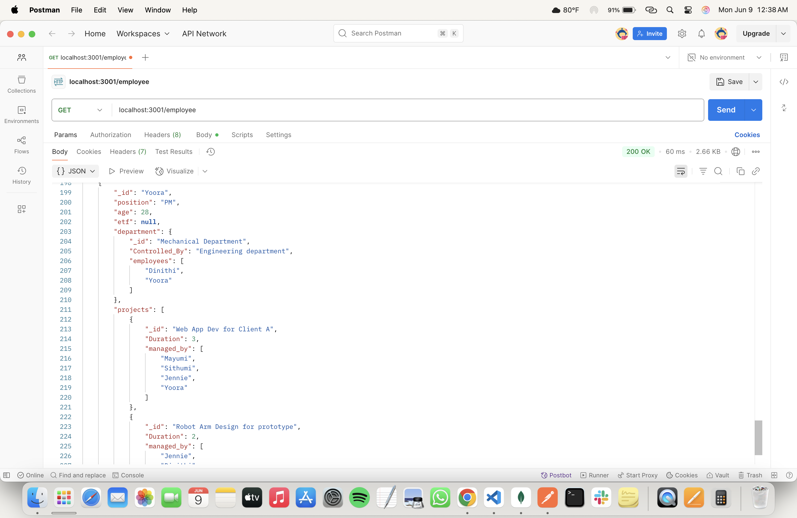
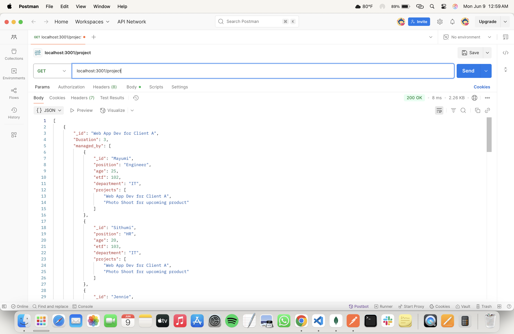

# 📅 2025-05-26-29 - 🍃 Employee App
This folder contains MongoDB practicals from **May 26-29, 2025**.

## 📜 Lesson Overview  
In this lesson, we learned the following,
- **How to create sub routes for different get queries requests**
- **One to many, Many to Many relationships**
---

### Get the employee details including the department & project details

### Get the project details

### Get the etf details

### Give the ID of a particular department and get the employee details

### Get the no of employees in each department

### Get the no of projects for each employee

### Get the details of the employees along with the projects

### Get the no of employees for each distinct positions

