# 📅 2025-05-07 - Assignment 04

Here's the assignment paper.
📄 [View Assignment](./Assignment4.pdf)

## 📂 Code Answer Files

|  Question        | Output Screenshot         |
|-------------------------|---------------------------|
| Create a Database Library |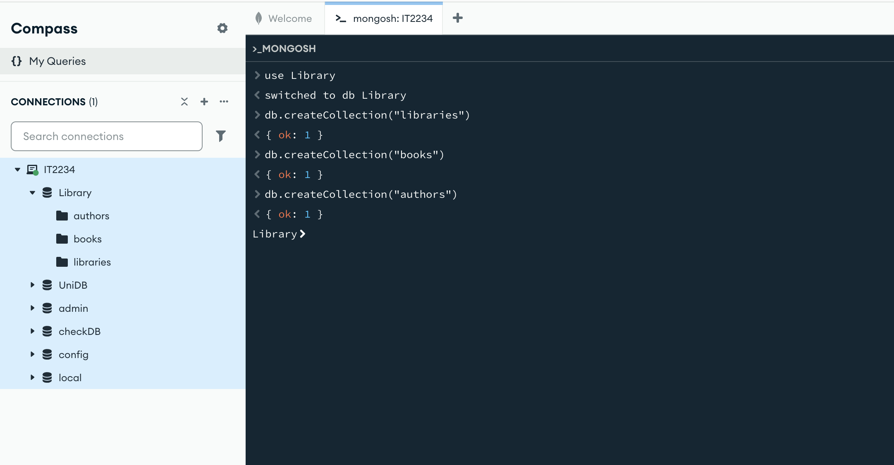|
| Create collections named libraries, books and authors ||
| Insert some sample documents into the collections|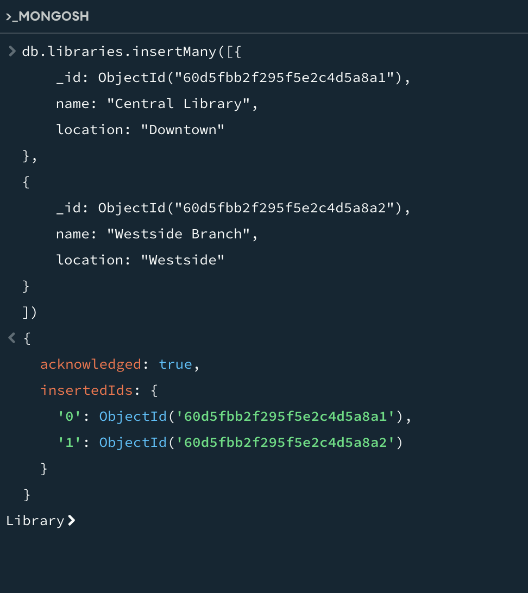 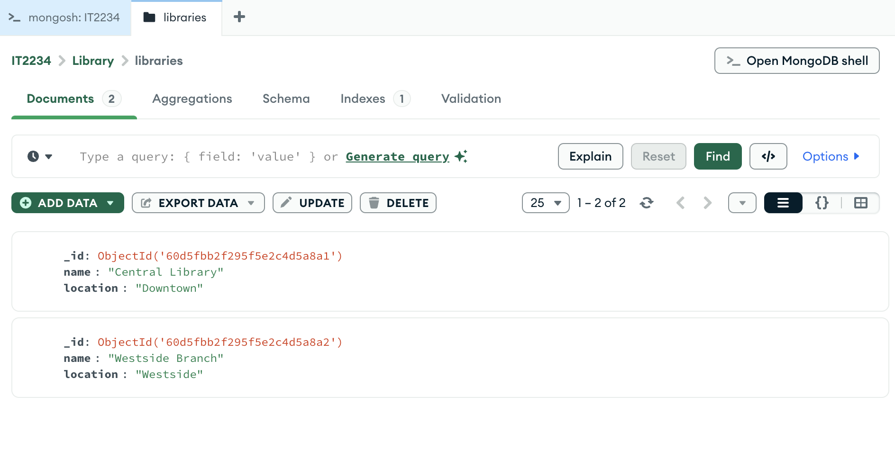 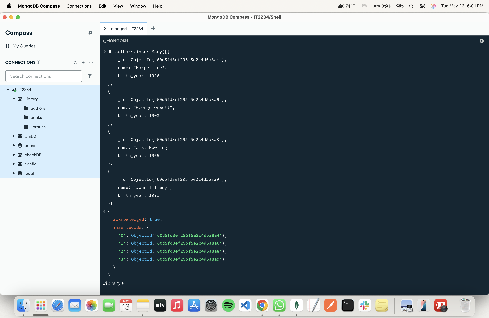 |
| Find all books in the "Central Library" |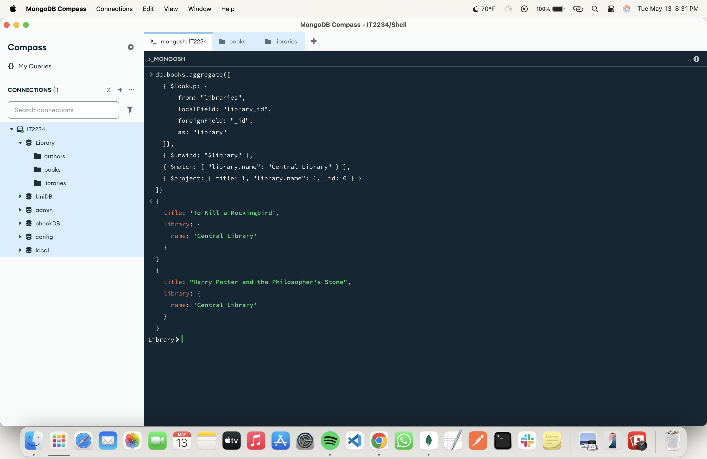|
| List all libraries along with the number of books they have |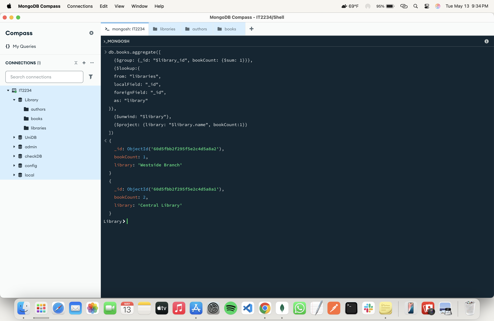|
| Find all books written by "J.K. Rowling" |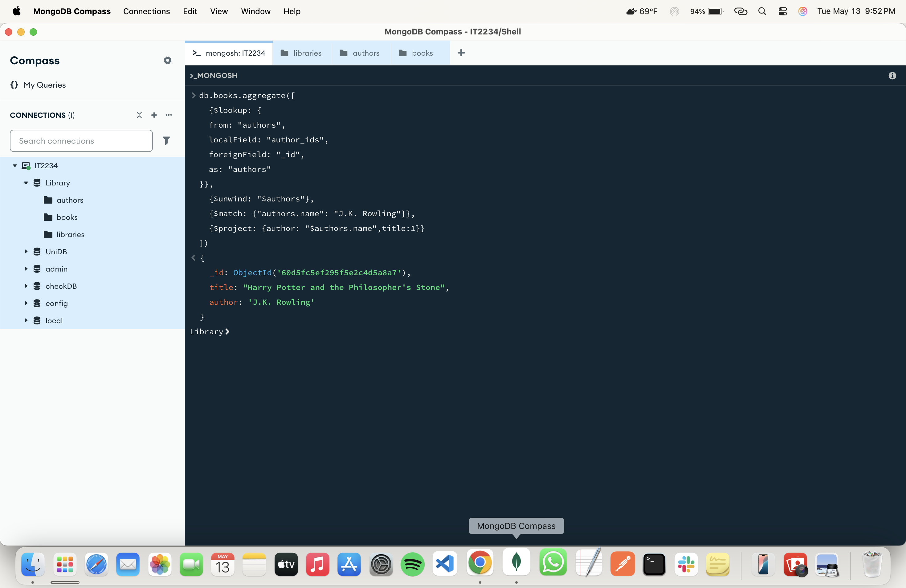|
| List all authors along with the books they have written |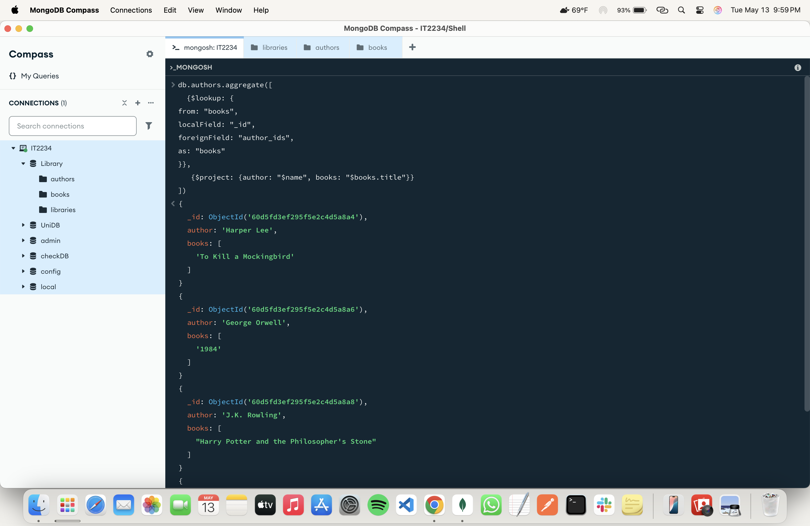 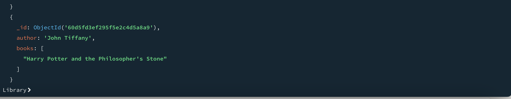|
| Find all books along with their authors' details |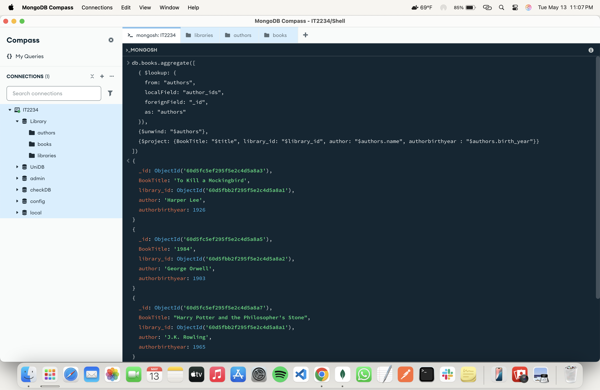 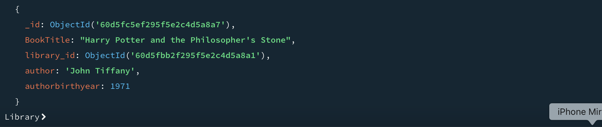|
| List all libraries and the number of books they have, including libraries with no books |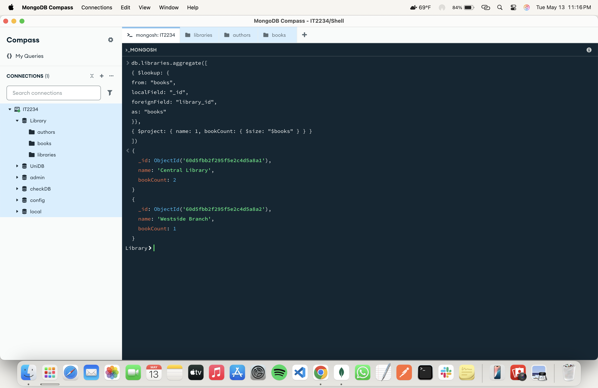|
| Calculate the average number of books per library |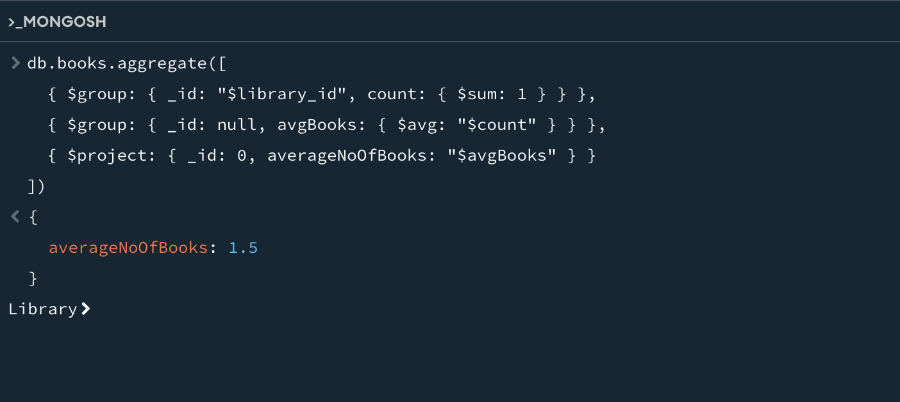|
| Find all authors who have written more than one book |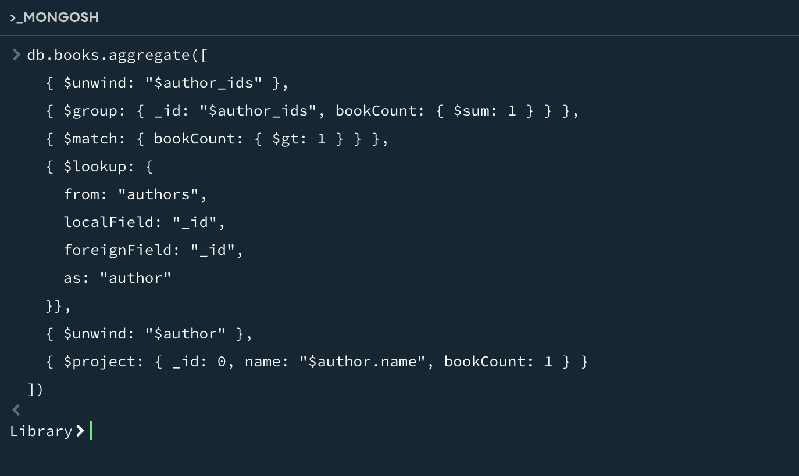|
| Retrieve all books along with their authors' names and the library they belong to |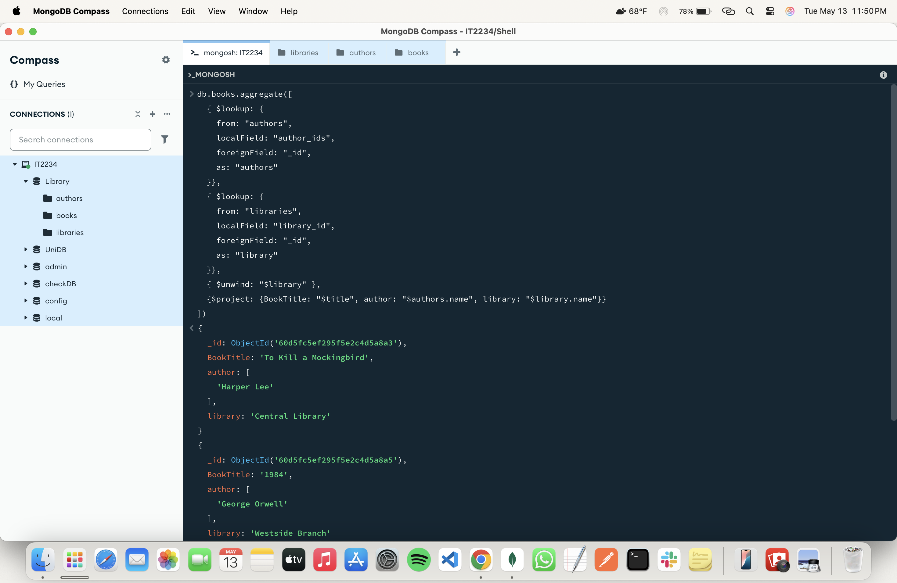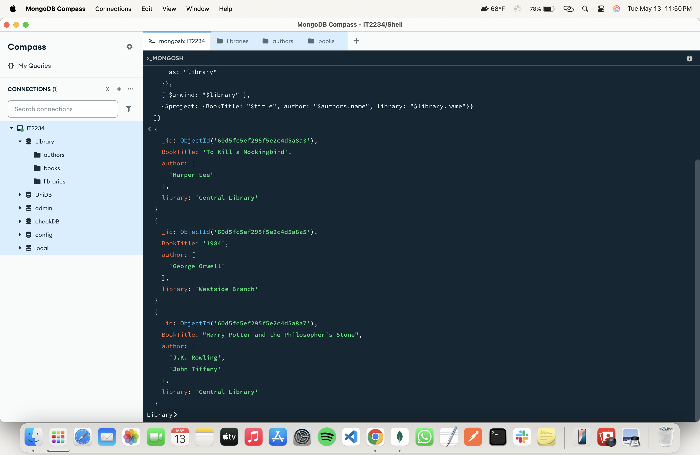|
| List all authors who have not written any books |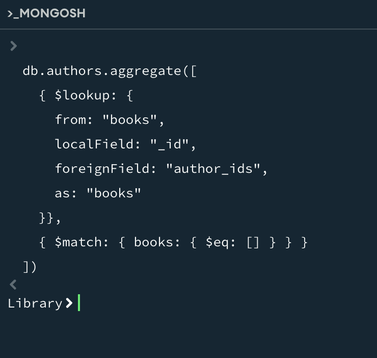|

---
