# 📅 2025-05-07 - Assignment 02

Here's the assignment paper.
📄 [View Assignment](./Assignment2.pdf)

## 📂 Code Answer Files

|  Question        | Output Screenshot         |
|-------------------------|---------------------------|
| Create a Database Library |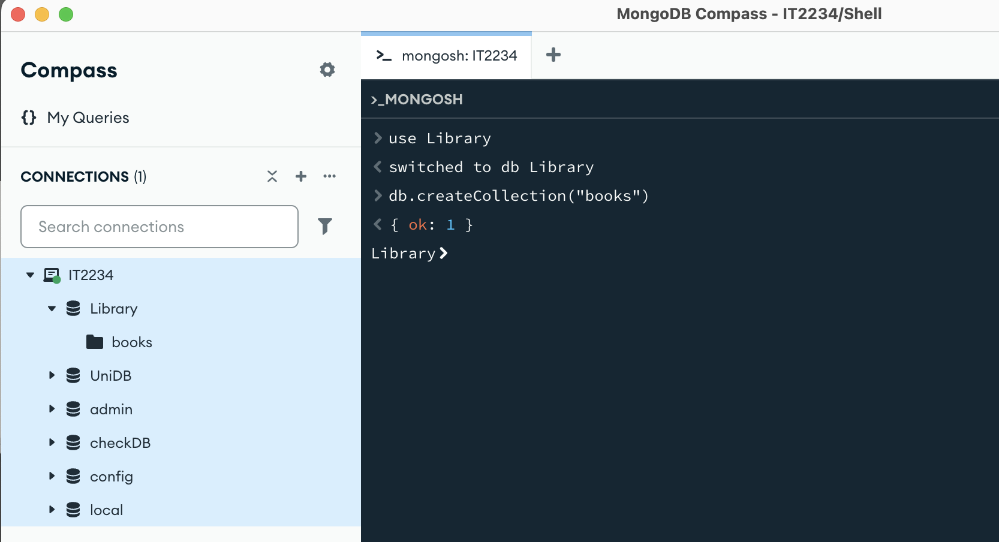|
| Create a collection named books ||
| Insert some sample documents into the ‘books’ collection| 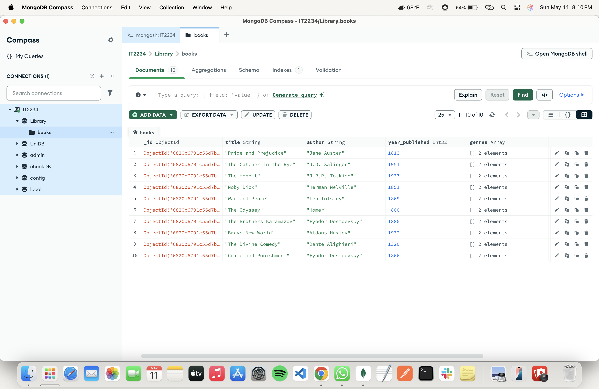|
| Find all documents in the ‘books’ collection |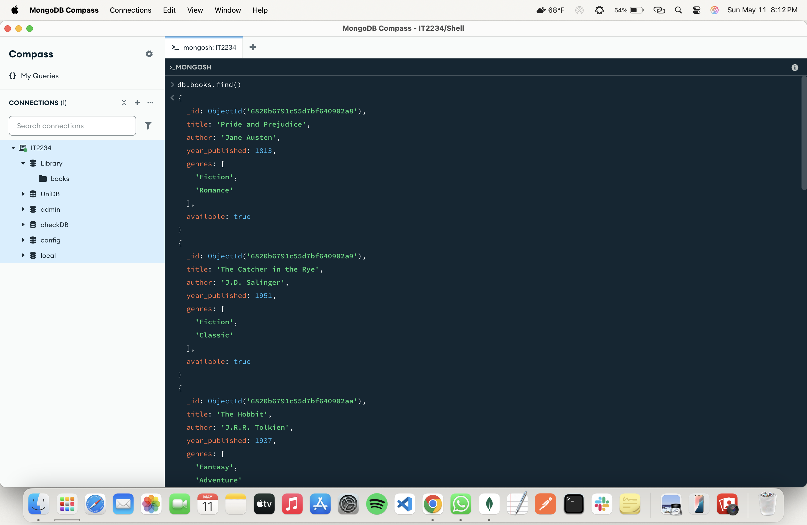|
| Find books published after 1950 |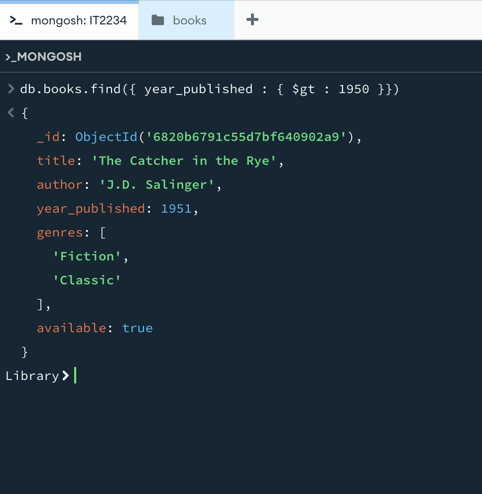|
| Find a book by title |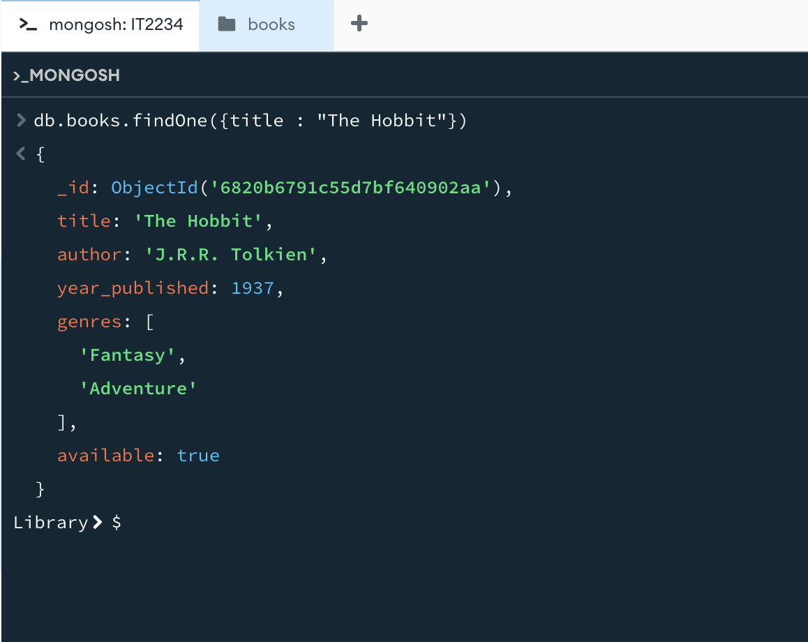|
| Update the year published for "The Great Gatsby" |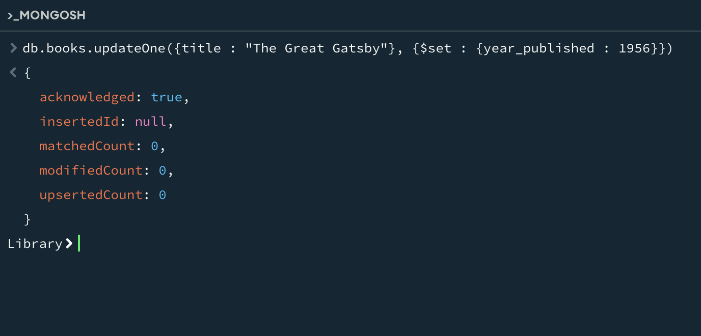|
| Update the available status of "Moby-Dick" to false |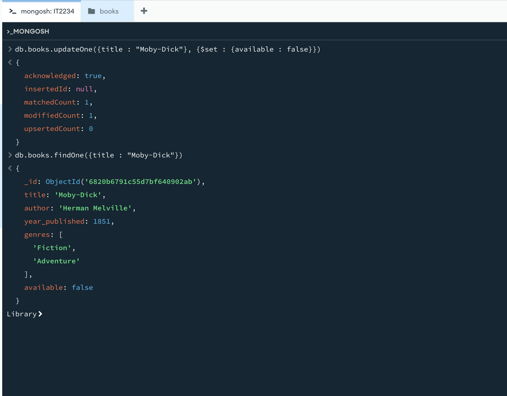|
| Set a new field checked_out to false for all available books |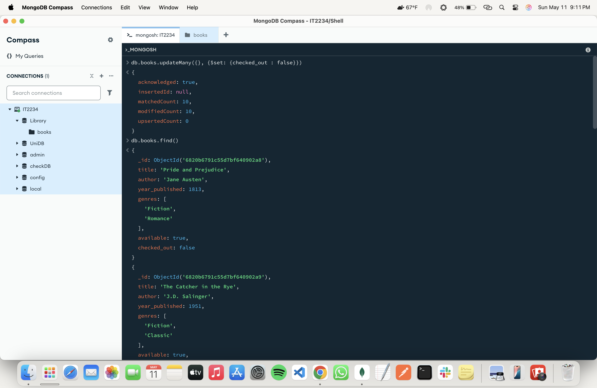|
| Change the checked_out status to true for books in the "Adventure" genre |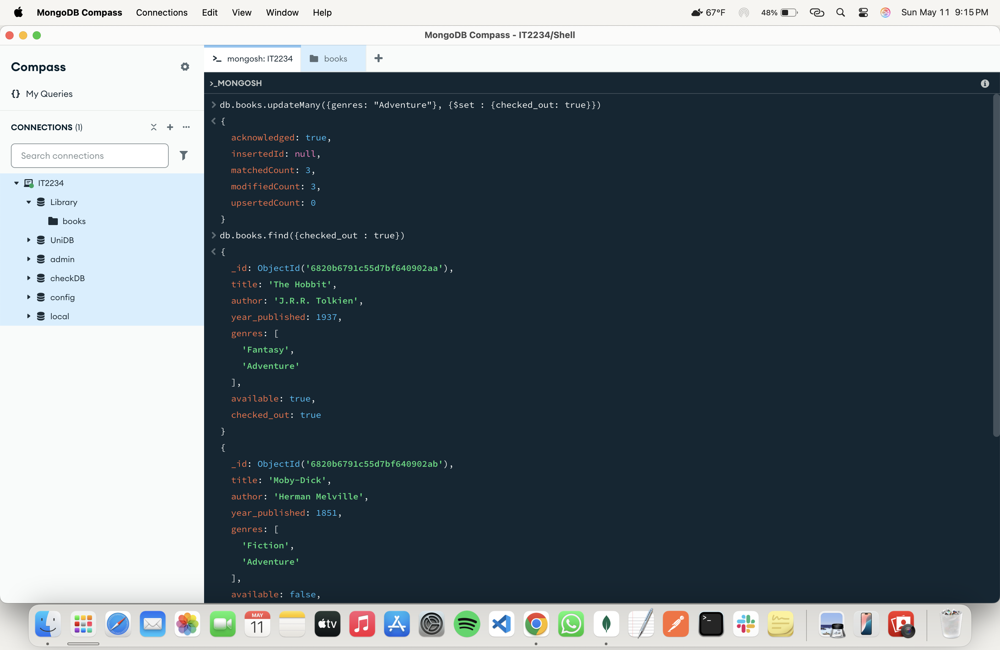|
| Delete a book by title |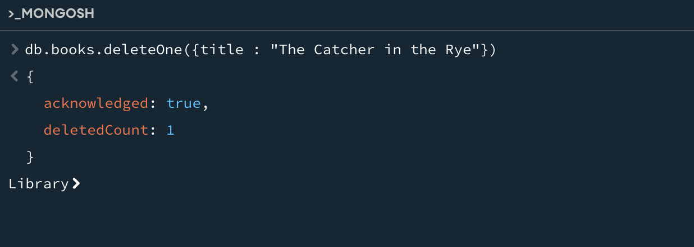|
| Delete all books published before 1930 |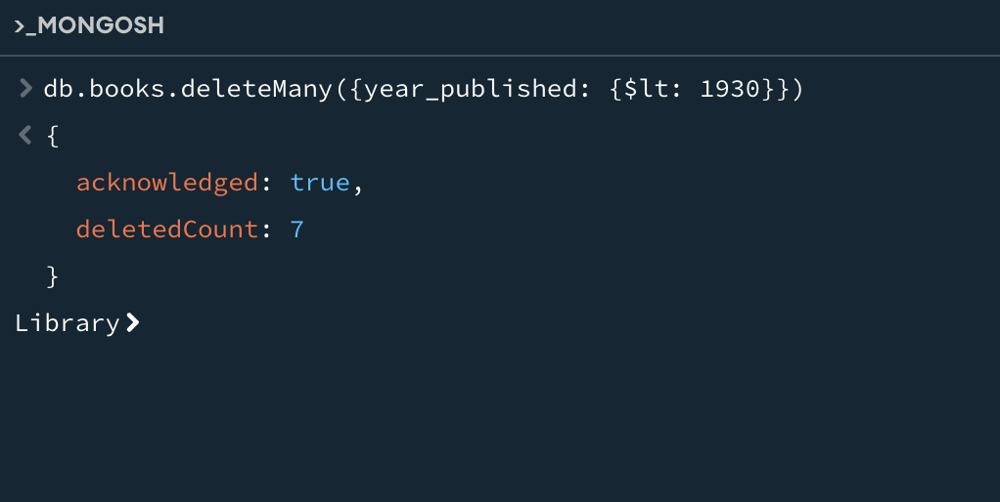|

---

